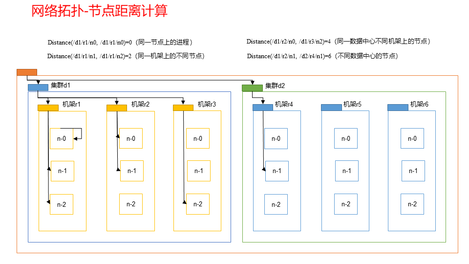
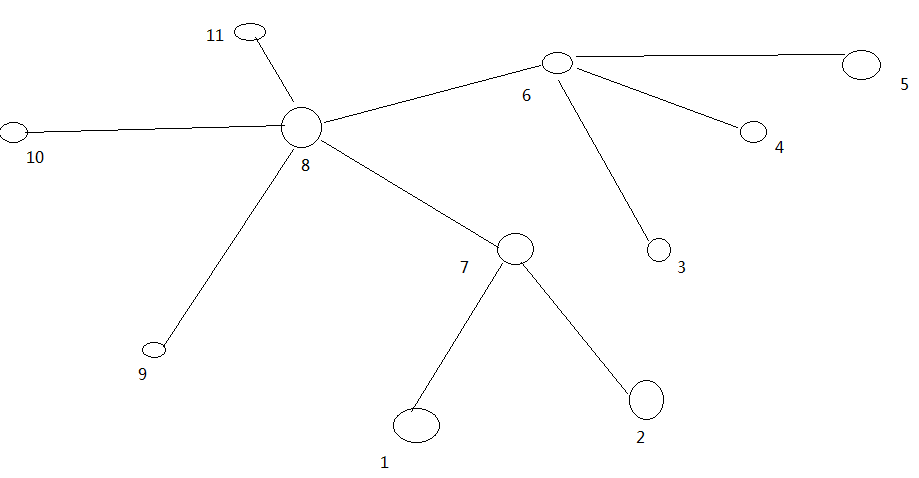
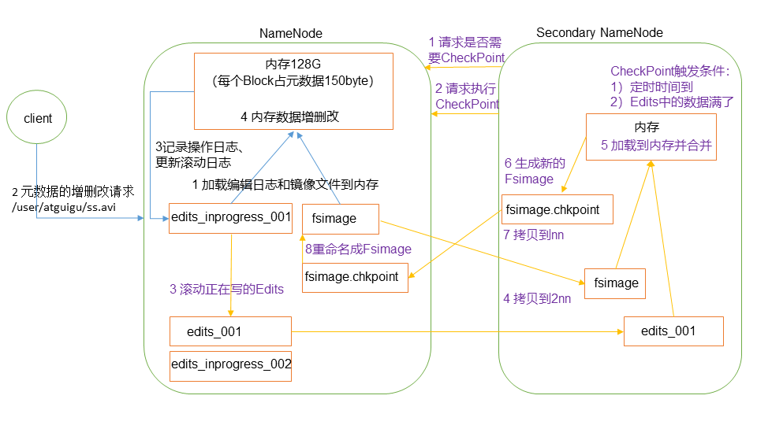
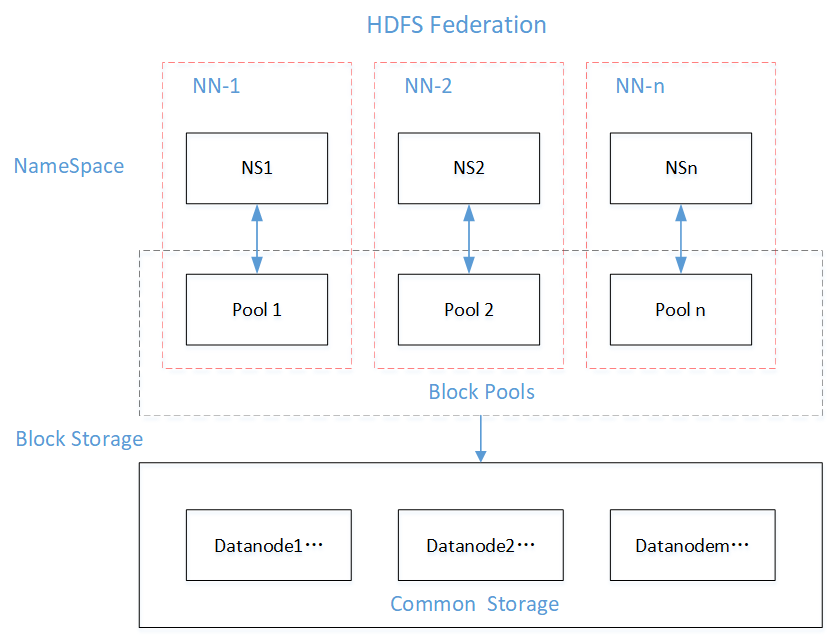

# 一、HDFS概述

## 1.背景和定义
**背景**
当数据量过大时，数据分配到更多的服务器节点，使用分布式文件系统用于管理多多服务器节点联合存储的数据
**定义**
Hadoop Distributed File System，是一个用于存储文件的文件系统
通过目录树来定位文件
是分布式的，由多个服务器联合实现功能，集群的服务器有各自的角色

**使用场景**
适合一次写入，多次读出的场景，不支持文件的修改。
适合用来做数据分析，并不适合做网盘应用。

## 2.优缺点

### 1.1优点

>高容错性
数据自动保存多个副本，通过增加副本的形式，提高容错性
某个副本丢失后可以自动恢复

>适合处理大数据
数据规模：能够处理数据规模达到GB、TB甚至PB级别的数据
文件规模：能够处理百万规模以上的文件数量

>可构建在廉价机器上
通过多副本机制提高可靠性

### 1.2缺点

>不适合低延时数据访问，比如毫秒级的存储数据

>无法高效的对大量小文件进行存储
存储大量小文件，会占用NameNode大量的文件内存来存储文件、目录和块信息
小文件存储的寻址时间会超过读取时间，违背了HDFS的设计目标

>不支持并发写入、文件随机修改
一个文件只能由一个写，不允许多个线程同时写
仅支持数据append（追加），不支持文件的随机修改

## 3.HDFS组成架构

>**NameNode**master,主管，管理者，
管理HDFS的名称空间
配置副本策略
管理数据块(Block)映射信息
处理客户端读写请求

>**DataNode**slave，NameNode下达命令，DataNode执行实际的操作
存储实际的数据块
执行数据快的读写操作

>**Client**客户端
文件切分，被上传的文件由Client切分成Block数据块然后上传至HDFS
与NameNode交互获取文件的位置信息
与DataNode交互读写数据
Client提供一些命令来管理HDFS，比如NameNode的格式化
Client提供一些命令来访问HDFS进行增删改查

>**SecondaryNameNode**
并不是NameNode的热备，当NameNode宕掉时并不能立即完成顶替
辅助NameNode分担工作量，如定期合并Fsimage和Edits并推送给NameNode
紧急情况下可辅助回复NameNode

## 4.HDFS文件块大小（面试重点）
HDFS中的文件分块存储(block),块的大小能够荣国参数(dfs.blocksize)来规定，Hadoop2.x中默认大小为128M，老版本中为64M


>**文件块不能设置太小，也不能设置太大**
块设置太小会增加寻址时间，程序会花费过多的时间来寻找块的位置
块设置太大会使磁盘传输数据的时间明显大于定位这个块开始位置所需的时间，导致程序处理数据块时过慢
**总结**：HDFS块的大小设置主要取决于**磁盘传输速率**


# 二、HDFS的Shell操作（开发重点）

```bash
#语法
bin/hadoop fs -command
hadoop fs -command
bin/hdfs dfs -command
hdfs dfs -command
```

```bash
bin/hadoop fs #命令提示
bin/hdfs dfs 
```
```
[-appendToFile <localsrc> ... <dst>]
        [-cat [-ignoreCrc] <src> ...]
        [-checksum <src> ...]
        [-chgrp [-R] GROUP PATH...]
        [-chmod [-R] <MODE[,MODE]... | OCTALMODE> PATH...]
        [-chown [-R] [OWNER][:[GROUP]] PATH...]
        [-copyFromLocal [-f] [-p] <localsrc> ... <dst>]
        [-copyToLocal [-p] [-ignoreCrc] [-crc] <src> ... <localdst>]
        [-count [-q] <path> ...]
        [-cp [-f] [-p] <src> ... <dst>]
        [-createSnapshot <snapshotDir> [<snapshotName>]]
        [-deleteSnapshot <snapshotDir> <snapshotName>]
        [-df [-h] [<path> ...]]
        [-du [-s] [-h] <path> ...]
        [-expunge]
        [-get [-p] [-ignoreCrc] [-crc] <src> ... <localdst>]
        [-getfacl [-R] <path>]
        [-getmerge [-nl] <src> <localdst>]
        [-help [cmd ...]]
        [-ls [-d] [-h] [-R] [<path> ...]]
        [-mkdir [-p] <path> ...]
        [-moveFromLocal <localsrc> ... <dst>]
        [-moveToLocal <src> <localdst>]
        [-mv <src> ... <dst>]
        [-put [-f] [-p] <localsrc> ... <dst>]
        [-renameSnapshot <snapshotDir> <oldName> <newName>]
        [-rm [-f] [-r|-R] [-skipTrash] <src> ...]
        [-rmdir [--ignore-fail-on-non-empty] <dir> ...]
        [-setfacl [-R] [{-b|-k} {-m|-x <acl_spec>} <path>]|[--set <acl_spec> <path>]]
        [-setrep [-R] [-w] <rep> <path> ...]
        [-stat [format] <path> ...]
        [-tail [-f] <file>]
        [-test -[defsz] <path>]
        [-text [-ignoreCrc] <src> ...]
        [-touchz <path> ...]
        [-usage [cmd ...]]
```

```bash
#（0）启动Hadoop集群（方便后续的测试）
sbin/start-dfs.sh
[tian@hadoop103 hadoop-2.7.2]$ sbin/start-yarn.sh
#（1）-help：输出这个命令参数
hadoop fs -help rm
#（2）-ls: 显示目录信息
hadoop fs -ls /
#（3）-mkdir：在HDFS上创建目录
hadoop fs -mkdir -p /sanguo/shuguo
#（4）-moveFromLocal：从本地剪切粘贴到HDFS
touch kongming.txt
hadoop fs  -moveFromLocal  ./kongming.txt  /sanguo/shuguo
#（5）-appendToFile：追加一个文件到已经存在的文件末尾
touch liubei.txt
vi liubei.txt #san gu mao lu
hadoop fs -appendToFile liubei.txt /sanguo/shuguo/kongming.txt
#（6）-cat：显示文件内容
hadoop fs -cat /sanguo/shuguo/kongming.txt
#（7）-chgrp 、-chmod、-chown：Linux文件系统中的用法一样，修改文件所属权限
hadoop fs  -chmod  666  /sanguo/shuguo/kongming.txt
hadoop fs  -chown  tian:tian   /sanguo/shuguo/kongming.txt
#（8）-copyFromLocal：从本地文件系统中拷贝文件到HDFS路径去
hadoop fs -copyFromLocal README.txt /
#（9）-copyToLocal：从HDFS拷贝到本地
hadoop fs -copyToLocal /sanguo/shuguo/kongming.txt ./
#（10）-cp ：从HDFS的一个路径拷贝到HDFS的另一个路径
hadoop fs -cp /sanguo/shuguo/kongming.txt /zhuge.txt
#（11）-mv：在HDFS目录中移动文件
hadoop fs -mv /zhuge.txt /sanguo/shuguo/
#（12）-get：等同于copyToLocal，就是从HDFS下载文件到本地
hadoop fs -get /sanguo/shuguo/kongming.txt ./
#（13）-getmerge：合并下载多个文件，比如HDFS的目录 /user/tian/test下有多个文件:log.1, log.2,log.3,...
hadoop fs -getmerge /user/tian/test/* ./zaiyiqi.txt
#（14）-put：等同于copyFromLocal
hadoop fs -put ./zaiyiqi.txt /user/tian/test/
#（15）-tail：显示一个文件的末尾
hadoop fs -tail /sanguo/shuguo/kongming.txt
#（16）-rm：删除文件或文件夹
hadoop fs -rm /user/tian/test/jinlian2.txt
#（17）-rmdir：删除空目录
hadoop fs -mkdir /test
hadoop fs -rmdir /test
#（18）-du统计文件夹的大小信息
hadoop fs -du -s -h /user/tian/test
#2.7 K  /user/tian/test

hadoop fs -du  -h /user/tian/test
#1.3 K  /user/tian/test/README.txt
#15     /user/tian/test/jinlian.txt
#1.4 K  /user/tian/test/zaiyiqi.txt
#（19）-setrep：设置HDFS中文件的副本数量
hadoop fs -setrep 10 /sanguo/shuguo/kongming.txt
```

这里设置的副本数只是记录在NameNode的元数据中，是否真的会有这么多副本，还得看DataNode的数量。因为目前只有3台设备，最多也就3个副本，只有节点数的增加到10台时，副本数才能达到10

# 三、HDFS的客户端操作（开发重点）

## 1.客户端环境准备

>**配置环境**
解压源码包至非中文路径
配置HADOOP_HOME，path中添加%HADOOP_HOME%\bin

**new Maven Project**

```xml
<dependencies>
		<dependency>
			<groupId>junit</groupId>
			<artifactId>junit</artifactId>
			<version>RELEASE</version>
		</dependency>
		<dependency>
			<groupId>org.apache.logging.log4j</groupId>
			<artifactId>log4j-core</artifactId>
			<version>2.8.2</version>
		</dependency>
		<dependency>
			<groupId>org.apache.hadoop</groupId>
			<artifactId>hadoop-common</artifactId>
			<version>2.7.2</version>
		</dependency>
		<dependency>
			<groupId>org.apache.hadoop</groupId>
			<artifactId>hadoop-client</artifactId>
			<version>2.7.2</version>
		</dependency>
		<dependency>
			<groupId>org.apache.hadoop</groupId>
			<artifactId>hadoop-hdfs</artifactId>
			<version>2.7.2</version>
		</dependency>
		<dependency>
			<groupId>jdk.tools</groupId>
			<artifactId>jdk.tools</artifactId>
			<version>1.8</version>
			<scope>system</scope>
			<systemPath>${JAVA_HOME}/lib/tools.jar</systemPath>
		</dependency>
</dependencies>
```

>注意：如果Eclipse/Idea打印不出日志，在控制台上只显示
1.log4j:WARN No appenders could be found for logger (org.apache.hadoop.util.Shell).  
2.log4j:WARN Please initialize the log4j system properly.  
3.log4j:WARN See http://logging.apache.org/log4j/1.2/faq.html#noconfig for more info.

需要在项目的src/main/resources目录下，新建log4j.properties写入以下内容
```
log4j.rootLogger=INFO, stdout
log4j.appender.stdout=org.apache.log4j.ConsoleAppender
log4j.appender.stdout.layout=org.apache.log4j.PatternLayout
log4j.appender.stdout.layout.ConversionPattern=%d %p [%c] - %m%n
log4j.appender.logfile=org.apache.log4j.FileAppender
log4j.appender.logfile.File=target/spring.log
log4j.appender.logfile.layout=org.apache.log4j.PatternLayout
log4j.appender.logfile.layout.ConversionPattern=%d %p [%c] - %m%n
```

**new package : com.tian.hdfs
new class : HdfsClient**
```java
public class HdfsClient{	
@Test
public void testMkdirs() throws IOException, InterruptedException, URISyntaxException{
		
		// 1 获取文件系统
		Configuration configuration = new Configuration();
		// 配置在集群上运行
		// configuration.set("fs.defaultFS", "hdfs://hadoop102:9000");
		// FileSystem fs = FileSystem.get(configuration);

		FileSystem fs = FileSystem.get(new URI("hdfs://hadoop102:9000"), configuration, "tian");
		
		// 2 创建目录
		fs.mkdirs(new Path("/1108/daxian/banzhang"));
		
		// 3 关闭资源
		fs.close();
	}
}
```

>**运行时需要配置用户名称**
客户端去操作HDFS时，是有一个用户身份的。
默认情况下，HDFS客户端API会从JVM中获取一个参数来作为自己的用户身份：
-DHADOOP_USER_NAME=tian，tian为用户名称。


## 2.HDFS的API操作

### 2.1文件上传（测试参数优先级）

**编写源代码**
```java
@Test
public void testCopyFromLocalFile() throws IOException, InterruptedException, URISyntaxException {

		// 1 获取文件系统
		Configuration configuration = new Configuration();
		configuration.set("dfs.replication", "2");
		FileSystem fs = FileSystem.get(new URI("hdfs://hadoop102:9000"), configuration, "tian");

		// 2 上传文件
		fs.copyFromLocalFile(new Path("e:/banzhang.txt"), new Path("/banzhang.txt"));

		// 3 关闭资源
		fs.close();

		System.out.println("over");
}
```
**配置hdfs-sit.xml**
拷贝到根目录下
```xml
<?xml version="1.0" encoding="UTF-8"?>
<?xml-stylesheet type="text/xsl" href="configuration.xsl"?>

<configuration>
	<property>
		<name>dfs.replication</name>
        <value>1</value>
	</property>
</configuration>
```

**参数优先级**
>参数优先级排序
↓客户端代码中这只的值
↓ClassPath下的用户自定义配置文件
↓服务器的默认配置

### 2.2文件下载

```java
@Test
public void testCopyToLocalFile() throws IOException, InterruptedException, URISyntaxException{

	// 1 获取文件系统
	Configuration configuration = new Configuration();
	FileSystem fs = FileSystem.get(new URI("hdfs://hadoop102:9000"), configuration, "tian");

	// 2 执行下载操作
	// boolean delSrc 指是否将原文件删除
	// Path src 指要下载的文件路径
	// Path dst 指将文件下载到的路径
	// boolean useRawLocalFileSystem 是否开启文件校验
	fs.copyToLocalFile(false, new Path("/banzhang.txt"), new Path("e:/banhua.txt"), true);

	// 3 关闭资源
	fs.close();
}
```

### 2.3文件夹删除

```java
@Test
public void testDelete() throws IOException, InterruptedException, URISyntaxException{

	// 1 获取文件系统
	Configuration configuration = new Configuration();
	FileSystem fs = FileSystem.get(new URI("hdfs://hadoop102:9000"), configuration, "tian");
		
	// 2 执行删除
	fs.delete(new Path("/0508/"), true);
		
	// 3 关闭资源
	fs.close();
}
```

### 2.4文件名更改

```java
@Test
public void testRename() throws IOException, InterruptedException, URISyntaxException{

	// 1 获取文件系统
	Configuration configuration = new Configuration();
	FileSystem fs = FileSystem.get(new URI("hdfs://hadoop102:9000"), configuration, "tian"); 
		
	// 2 修改文件名称
	fs.rename(new Path("/banzhang.txt"), new Path("/banhua.txt"));
		
	// 3 关闭资源
	fs.close();
}
```

### 2.5文件详情查看

```java
@Test
public void testListFiles() throws IOException, InterruptedException, URISyntaxException{

	// 1获取文件系统
	Configuration configuration = new Configuration();
	FileSystem fs = FileSystem.get(new URI("hdfs://hadoop102:9000"), configuration, "tian"); 
		
	// 2 获取文件详情
	RemoteIterator<LocatedFileStatus> listFiles = fs.listFiles(new Path("/"), true);
		
	while(listFiles.hasNext()){
		LocatedFileStatus status = listFiles.next();
			
		// 输出详情
		// 文件名称
		System.out.println(status.getPath().getName());
		// 长度
		System.out.println(status.getLen());
		// 权限
		System.out.println(status.getPermission());
		// 分组
		System.out.println(status.getGroup());
			
		// 获取存储的块信息
		BlockLocation[] blockLocations = status.getBlockLocations();
			
		for (BlockLocation blockLocation : blockLocations) {
				
			// 获取块存储的主机节点
			String[] hosts = blockLocation.getHosts();
				
			for (String host : hosts) {
				System.out.println(host);
			}
		}
			
		System.out.println("-----------班长的分割线----------");
	}

// 3 关闭资源
fs.close();
}
```

### 2.6文件和文件夹判断

```java
@Test
public void testListStatus() throws IOException, InterruptedException, URISyntaxException{
		
	// 1 获取文件配置信息
	Configuration configuration = new Configuration();
	FileSystem fs = FileSystem.get(new URI("hdfs://hadoop102:9000"), configuration, "tian");
		
	// 2 判断是文件还是文件夹
	FileStatus[] listStatus = fs.listStatus(new Path("/"));
		
	for (FileStatus fileStatus : listStatus) {
		
		// 如果是文件
		if (fileStatus.isFile()) {
				System.out.println("f:"+fileStatus.getPath().getName());
			}else {
				System.out.println("d:"+fileStatus.getPath().getName());
			}
		}
		
	// 3 关闭资源
	fs.close();
}
```

## 3.HDFS IO


# 四、HDFS的数据流（面试重点）


## 1.HDFS写数据流程

### 1.1剖析文件写入


>1）客户端通过Distributed FileSystem模块向NameNode请求上传文件，NameNode检查目标文件是否已存在，父目录是否存在。
2）NameNode返回是否可以上传。
3）客户端请求第一个 Block上传到哪几个DataNode服务器上。
4）NameNode返回3个DataNode节点，分别为dn1、dn2、dn3。
5）客户端通过FSDataOutputStream模块请求dn1上传数据，dn1收到请求会继续调用dn2，然后dn2调用dn3，将这个通信管道建立完成。
6）dn1、dn2、dn3逐级应答客户端。
7）客户端开始往dn1上传第一个Block（先从磁盘读取数据放到一个本地内存缓存），以Packet为单位，dn1收到一个Packet就会传给dn2，dn2传给dn3；**dn1每传一个packet会放入一个应答队列等待应答**。
8）当一个Block传输完成之后，客户端再次请求NameNode上传第二个Block的服务器。（重复执行3-7步）。

*节点间先存数据再传数据，应答成功用于确定成功传输文件。*

### 1.2网络拓扑-节点距离计算

**节点距离**：两个节点到达最近的共同祖先的距离总和。
NameNode会选择距离待上传数据最近距离的DataNode接收数据





### 1.3机架感知(副本存储节点选择)

[机架感知说明](http://hadoop.apache.org/docs/r2.7.2/hadoop-project-dist/hadoop-hdfs/HdfsDesign.html#Data_Replication)

>For the common case, when the replication factor is three, HDFS’s placement policy is to put one replica on one node in the local rack, another on a different node in the local rack, and the last on a different node in a different rack.


## 2.HDFS读数据流程


>1）客户端通过Distributed FileSystem向NameNode请求下载文件，NameNode通过查询元数据，找到文件块所在的DataNode地址。
2）挑选一台DataNode（就近原则，然后随机）服务器，请求读取数据。
3）DataNode开始传输数据给客户端（从磁盘里面读取数据输入流，以Packet为单位来做校验）。
4）客户端以Packet为单位接收，先在本地缓存，然后写入目标文件。

# 五、NameNodo & SecondaryNameNode （面试重点）

## 1.NN和2NN的工作机制

>**NameNode存储**
首先，我们做个假设，如果存储在NameNode节点的磁盘中，因为经常需要进行随机访问，还有响应客户请求，必然是效率过低。因此，元数据需要存放在内存中。但如果只存在内存中，一旦断电，元数据丢失，整个集群就无法工作了。因此产生在磁盘中备份元数据的**FsImage**。
这样又会带来新的问题，当在内存中的元数据更新时，如果同时更新FsImage，就会导致效率过低，但如果不更新，就会发生一致性问题，一旦NameNode节点断电，就会产生数据丢失。因此，引入**Edits**文件(只进行追加操作，效率很高)。每当元数据有更新或者添加元数据时，修改内存中的元数据并追加到Edits中。这样，一旦NameNode节点断电，可以通过FsImage和Edits的合并，合成元数据。
但是，如果长时间添加数据到Edits中，会导致该文件数据过大，效率降低，而且一旦断电，恢复元数据需要的时间过长。因此，需要定期进行FsImage和Edits的合并，如果这个操作由NameNode节点完成，又会效率过低。因此，引入一个新的节点**SecondaryNamenode**，专门用于FsImage和Edits的合并。



>**第一阶段：NameNode启动**
第一次启动NameNode格式化后，创建Fsimage和Edits文件。如果不是第一次启动，直接加载编辑日志和镜像文件到内存。
客户端对元数据进行增删改的请求。
NameNode记录操作日志，更新滚动日志。
NameNode在内存中对元数据进行增删改。
>**第二阶段：Secondary NameNode工作**
Secondary NameNode询问NameNode是否需要CheckPoint。直接带回NameNode是否检查结果。
Secondary NameNode请求执行CheckPoint。
NameNode滚动正在写的Edits日志。
将滚动前的编辑日志和镜像文件拷贝到Secondary NameNode。
Secondary NameNode加载编辑日志和镜像文件到内存，并合并。
生成新的镜像文件fsimage.chkpoint。
拷贝fsimage.chkpoint到NameNode。
NameNode将fsimage.chkpoint重新命名成fsimage。

>***NN和2NN工作机制详解***
Fsimage：NameNode内存中元数据序列化后形成的文件。
Edits：记录客户端更新元数据信息的每一步操作（可通过Edits运算出元数据）。
NameNode启动时，先滚动Edits并生成一个空的edits.inprogress，然后加载Edits和Fsimage到内存中，此时NameNode内存就持有最新的元数据信息。Client开始对NameNode发送元数据的增删改的请求，这些请求的操作首先会被记录到edits.inprogress中（查询元数据的操作不会被记录在Edits中，因为查询操作不会更改元数据信息），如果此时NameNode挂掉，重启后会从Edits中读取元数据的信息。然后，NameNode会在内存中执行元数据的增删改的操作。
由于Edits中记录的操作会越来越多，Edits文件会越来越大，导致NameNode在启动加载Edits时会很慢，所以需要对Edits和Fsimage进行合并（所谓合并，就是将Edits和Fsimage加载到内存中，照着Edits中的操作一步步执行，最终形成新的Fsimage）。SecondaryNameNode的作用就是帮助NameNode进行Edits和Fsimage的合并工作。
SecondaryNameNode首先会询问NameNode是否需要CheckPoint（触发CheckPoint需要满足两个条件中的任意一个，定时时间到和Edits中数据写满了）。直接带回NameNode是否检查结果。SecondaryNameNode执行CheckPoint操作，首先会让NameNode滚动Edits并生成一个空的edits.inprogress，滚动Edits的目的是给Edits打个标记，以后所有新的操作都写入edits.inprogress，其他未合并的Edits和Fsimage会拷贝到SecondaryNameNode的本地，然后将拷贝的Edits和Fsimage加载到内存中进行合并，生成fsimage.chkpoint，然后将fsimage.chkpoint拷贝给NameNode，重命名为Fsimage后替换掉原来的Fsimage。NameNode在启动时就只需要加载之前未合并的Edits和Fsimage即可，因为合并过的Edits中的元数据信息已经被记录在Fsimage中。


## 2.Fsimage和Edits解析

### 2.1概念

NameNode被格式化之后，将在`/opt/module/hadoop-2.7.2/data/tmp/dfs/name/current`目录中产生如下文件
```
fsimage_0000000000000000000
fsimage_0000000000000000000.md5
seen_txid
VERSION
```
>**Fsimage**文件：HDFS文件系统元数据的一个永久性的检查点，其中包含HDFS文件系统的所有目录和文件inode的序列化信息。 
**Edits**文件：存放HDFS文件系统的所有更新操作的路径，文件系统客户端执行的所有写操作首先会被记录到Edits文件中。 
**seen_txid**文件:保存的是一个数字，就是最后一个edits_的数字
**NameNode**每次启动的时候都会将Fsimage文件读入内存，加载Edits里面的更新操作，保证内存中的元数据信息是最新的、同步的，可以看成NameNode启动的时候就将Fsimage和Edits文件进行了合并。

### 2.2oiv查看Fsimage文件
```bash
#查看oiv和oev命令
hdfs
oiv            apply the offline fsimage viewer to an fsimage
oev            apply the offline edits viewer to an edits file
#基本语法
hdfs oiv -p 文件类型 -i镜像文件 -o 转换后文件输出路径
#案例实操
pwd
/opt/module/hadoop-2.7.2/data/tmp/dfs/name/current
hdfs oiv -p XML -i fsimage_0000000000000000025 -o /opt/module/hadoop-2.7.2/fsimage.xml
cat /opt/module/hadoop-2.7.2/fsimage.xml
```

```xml
<!-- 将显示的xml文件内容拷贝到Eclipse中创建的xml文件中，并格式化。部分显示结果 -->
<inode>
	<id>16386</id>
	<type>DIRECTORY</type>
	<name>user</name>
	<mtime>1512722284477</mtime>
	<permission>tian:supergroup:rwxr-xr-x</permission>
	<nsquota>-1</nsquota>
	<dsquota>-1</dsquota>
</inode>
<inode>
	<id>16387</id>
	<type>DIRECTORY</type>
	<name>tian</name>
	<mtime>1512790549080</mtime>
	<permission>tian:supergroup:rwxr-xr-x</permission>
	<nsquota>-1</nsquota>
	<dsquota>-1</dsquota>
</inode>
<inode>
	<id>16389</id>
	<type>FILE</type>
	<name>wc.input</name>
	<replication>3</replication>
	<mtime>1512722322219</mtime>
	<atime>1512722321610</atime>
	<perferredBlockSize>134217728</perferredBlockSize>
	<permission>tian:supergroup:rw-r--r--</permission>
	<blocks>
		<block>
			<id>1073741825</id>
			<genstamp>1001</genstamp>
			<numBytes>59</numBytes>
		</block>
	</blocks>
</inode >
```
>**思考**
Fsimage中没有记录块所对应DataNode
在集群启动后，要求DataNode上报数据块信息，并间隔一段时间后再次上报。

### 2.3oev查看Edits文件
```bash
#基本语法
hdfs oev -p 文件类型 -i编辑日志 -o 转换后文件输出路径
#案例实操
hdfs oev -p XML -i edits_0000000000000000012-0000000000000000013 -o /opt/module/hadoop-2.7.2/edits.xml
cat /opt/module/hadoop-2.7.2/edits.xml
```
```xml
<!-- 将显示的xml文件内容拷贝到Eclipse中创建的xml文件中，并格式化。显示结果 -->
<?xml version="1.0" encoding="UTF-8"?>
<EDITS>
	<EDITS_VERSION>-63</EDITS_VERSION>
	<RECORD>
		<OPCODE>OP_START_LOG_SEGMENT</OPCODE>
		<DATA>
			<TXID>129</TXID>
		</DATA>
	</RECORD>
	<RECORD>
		<OPCODE>OP_ADD</OPCODE>
		<DATA>
			<TXID>130</TXID>
			<LENGTH>0</LENGTH>
			<INODEID>16407</INODEID>
			<PATH>/hello7.txt</PATH>
			<REPLICATION>2</REPLICATION>
			<MTIME>1512943607866</MTIME>
			<ATIME>1512943607866</ATIME>
			<BLOCKSIZE>134217728</BLOCKSIZE>
			<CLIENT_NAME>DFSClient_NONMAPREDUCE_-1544295051_1</CLIENT_NAME>
			<CLIENT_MACHINE>192.168.1.5</CLIENT_MACHINE>
			<OVERWRITE>true</OVERWRITE>
			<PERMISSION_STATUS>
				<USERNAME>tian</USERNAME>
				<GROUPNAME>supergroup</GROUPNAME>
				<MODE>420</MODE>
			</PERMISSION_STATUS>
			<RPC_CLIENTID>908eafd4-9aec-4288-96f1-e8011d181561</RPC_CLIENTID>
			<RPC_CALLID>0</RPC_CALLID>
		</DATA>
	</RECORD>
	<RECORD>
		<OPCODE>OP_ALLOCATE_BLOCK_ID</OPCODE>
		<DATA>
			<TXID>131</TXID>
			<BLOCK_ID>1073741839</BLOCK_ID>
		</DATA>
	</RECORD>
	<RECORD>
		<OPCODE>OP_SET_GENSTAMP_V2</OPCODE>
		<DATA>
			<TXID>132</TXID>
			<GENSTAMPV2>1016</GENSTAMPV2>
		</DATA>
	</RECORD>
	<RECORD>
		<OPCODE>OP_ADD_BLOCK</OPCODE>
		<DATA>
			<TXID>133</TXID>
			<PATH>/hello7.txt</PATH>
			<BLOCK>
				<BLOCK_ID>1073741839</BLOCK_ID>
				<NUM_BYTES>0</NUM_BYTES>
				<GENSTAMP>1016</GENSTAMP>
			</BLOCK>
			<RPC_CLIENTID></RPC_CLIENTID>
			<RPC_CALLID>-2</RPC_CALLID>
		</DATA>
	</RECORD>
	<RECORD>
		<OPCODE>OP_CLOSE</OPCODE>
		<DATA>
			<TXID>134</TXID>
			<LENGTH>0</LENGTH>
			<INODEID>0</INODEID>
			<PATH>/hello7.txt</PATH>
			<REPLICATION>2</REPLICATION>
			<MTIME>1512943608761</MTIME>
			<ATIME>1512943607866</ATIME>
			<BLOCKSIZE>134217728</BLOCKSIZE>
			<CLIENT_NAME></CLIENT_NAME>
			<CLIENT_MACHINE></CLIENT_MACHINE>
			<OVERWRITE>false</OVERWRITE>
			<BLOCK>
				<BLOCK_ID>1073741839</BLOCK_ID>
				<NUM_BYTES>25</NUM_BYTES>
				<GENSTAMP>1016</GENSTAMP>
			</BLOCK>
			<PERMISSION_STATUS>
				<USERNAME>tian</USERNAME>
				<GROUPNAME>supergroup</GROUPNAME>
				<MODE>420</MODE>
			</PERMISSION_STATUS>
		</DATA>
	</RECORD>
</EDITS >
```
思考：NameNode如何确定下次开机启动的时候合并哪些Edits？

## 3.CheckPoint时间设置

通常情况下，SecondaryNameNode每隔一小时执行一次。
```xml
<!-- hdfs-default.xml -->
<property>
  <name>dfs.namenode.checkpoint.period</name>
  <value>3600</value>
</property>
```
一分钟检查一次操作次数，3当操作次数达到1百万时，SecondaryNameNode执行一次。
```xml
<property>
  <name>dfs.namenode.checkpoint.txns</name>
  <value>1000000</value>
<description>操作动作次数</description>
</property>

<property>
  <name>dfs.namenode.checkpoint.check.period</name>
  <value>60</value>
<description> 1分钟检查一次操作次数</description>
</property >
```


## 4.NameNode故障处理

**方法一:将SecondaryNameNode中数据拷贝到NameNode存储数据的目录**
```bash
1. kill -9 NameNode进程
2. 删除NameNode存储的数据（/opt/module/hadoop-2.7.2/data/tmp/dfs/name）
rm -rf /opt/module/hadoop-2.7.2/data/tmp/dfs/name/*
3. 拷贝SecondaryNameNode中数据到原NameNode存储数据目录
scp -r tian@hadoop104:/opt/module/hadoop-2.7.2/data/tmp/dfs/namesecondary/* ./name/
4. 重新启动NameNode
sbin/hadoop-daemon.sh start namenode
```

**方法二:使用-importCheckpoint选项启动NameNode守护进程，从而将SecondaryNameNode中数据拷贝到NameNode目录中**

1.	修改hdfs-site.xml中的
```xml
<property>
  <name>dfs.namenode.checkpoint.period</name>
  <value>120</value>
</property>

<property>
  <name>dfs.namenode.name.dir</name>
  <value>/opt/module/hadoop-2.7.2/data/tmp/dfs/name</value>
</property>
```
2.  kill -9 NameNode进程
3.	删除NameNode存储的数据`/opt/module/hadoop-2.7.2/data/tmp/dfs/name`
```bash
rm -rf /opt/module/hadoop-2.7.2/data/tmp/dfs/name/*
```
4.	如果SecondaryNameNode不和NameNode在一个主机节点上，需要将SecondaryNameNode存储数据的目录拷贝到NameNode存储数据的平级目录，并删除in_use.lock文件

```bash
scp -r tian@hadoop104:/opt/module/hadoop-2.7.2/data/tmp/dfs/namesecondary ./
rm -rf in_use.lock
pwd
#/opt/module/hadoop-2.7.2/data/tmp/dfs
ls
#data  name  namesecondary
```
5.	导入检查点数据（等待一会ctrl+c结束掉）
```
bin/hdfs namenode -importCheckpoint
```
6.	启动NameNode
```bash
sbin/hadoop-daemon.sh start namenode
```

## 5.集群安全模式

### 5.1概述

>**NameNode启动**
NameNode启动时，首先将镜像文件（Fsimage）载入内存，并执行编辑日志（Edits）中的各项操作。一旦在内存中成功建立文件系统元数据的映像，则创建一个新的Fsimage文件和一个空的编辑日志。此时，NameNode开始监听DataNode请求。这个过程期间，NameNode一直运行在安全模式，即NameNode的文件系统对于客户端来说是只读的。

>**DataNode启动**
系统中的数据块的位置并不是由NameNode维护的，而是以块列表的形式存储在DataNode中。在系统的正常操作期间，NameNode会在内存中保留所有块位置的映射信息。在安全模式下，各个DataNode会向NameNode发送最新的块列表信息，NameNode了解到足够多的块位置信息之后，即可高效运行文件系统。

>**安全模式退出判断**
如果满足“最小副本条件”，NameNode会在30秒钟之后就退出安全模式。所谓的最小副本条件指的是在整个文件系统中99.9%的块满足最小副本级别（默认值：dfs.replication.min=1）。在启动一个刚刚格式化的HDFS集群时，因为系统中还没有任何块，所以NameNode不会进入安全模式。


### 5.2语法

集群处于安全模式，不能执行重要操作（写操作）。集群启动完成后，自动退出安全模式。
```bash
bin/hdfs dfsadmin -safemode get	 #查看安全模式状态
bin/hdfs dfsadmin -safemode enter   #进入安全模式状态
bin/hdfs dfsadmin -safemode leave #离开安全模式状态
bin/hdfs dfsadmin -safemode wait #等待安全模式状态
```

### 5.3案例
```bash
#模拟等待安全模式
#查看当前模式
hdfs dfsadmin -safemode get
Safe mode is OFF
#先进入安全模式
bin/hdfs dfsadmin -safemode enter
#创建并执行下面的脚本
#在/opt/module/hadoop-2.7.2路径上，编辑一个脚本safemode.sh
touch safemode.sh
vim safemode.sh
chmod 777 safemode.sh
./safemode.sh 
#再打开一个窗口，执行
bin/hdfs dfsadmin -safemode leave
#观察
#再观察上一个窗口
##Safe mode is OFF
#HDFS集群上已经有上传的数据了。
```

```sh
# safemode.sh
#!/bin/bash
hdfs dfsadmin -safemode wait
hdfs dfs -put /opt/module/hadoop-2.7.2/README.txt /
```

## 6.NameNode多目录配置

***视频12*** 	

# 六、DataNode（面试开发重点）

## 1.DataNode工作机制


1）一个数据块在DataNode上以文件形式存储在磁盘上，包括两个文件，一个是数据本身，一个是元数据包括数据块的长度，块数据的校验和，以及时间戳。
2）DataNode启动后向NameNode注册，通过后，周期性（1小时）的向NameNode上报所有的块信息。
3）心跳是每3秒一次，心跳返回结果带有NameNode给该DataNode的命令如复制块数据到另一台机器，或删除某个数据块。如果超过10分钟没有收到某个DataNode的心跳，则认为该节点不可用。
4）集群运行中可以安全加入和退出一些机器。

## 2.数据完整性

思考：如果电脑磁盘里面存储的数据是控制高铁信号灯的红灯信号（1）和绿灯信号（0），但是存储该数据的磁盘坏了，一直显示是绿灯，是否很危险？同理DataNode节点上的数据损坏了，却没有发现，是否也很危险，那么如何解决呢？
如下是DataNode节点保证数据完整性的方法。
1）当DataNode读取Block的时候，它会计算CheckSum。
2）如果计算后的CheckSum，与Block创建时值不一样，说明Block已经损坏。
3）Client读取其他DataNode上的Block。
4）DataNode在其文件创建后周期验证CheckSum


## 3.掉线时限参数设置

1. DataNode进程死亡或者网络故障造成DataNode无法与NameNode通信
2. NameNode不会立即把该节点判断为死亡，要经过一段时间，这段时间暂称作超时时长
3. HDFS默认的超时时长为10分钟+30秒
4. 如果定义超时时间为TimeOut，则超时时长的计算公式为:
   
$TimeOut = 2 * dfs.namenode.heartbeat.recheck-interval + 10 * dfs.heartbeat.interval$

而默认的`dfs.namenode.heartbeat.checheck-interval`大小为5分钟`dfs.heartbeat.interval`默认为3秒
`TimeOut`时间则为10分30秒

**hdfs-site.xml**
`heartbeat.recheck.interval`的单位为**毫秒**
`dfs.heartbeat.interval`的单位为**秒**

```xml
<property>
    <name>dfs.namenode.heartbeat.recheck-interval</name>
    <value>300000</value>
</property>
<property>
    <name>dfs.heartbeat.interval</name>
    <value>3</value>
</property>
```

## 4.服役新数据节点

**4.0需求**
随着公司业务的增长，数据量越来越大，原有的数据节点的容量已经不能满足存储数据的需求，需要在原有集群基础上动态添加新的数据节点。

**4.1环境准备**
在hadoop104主机上再克隆一台hadoop105主机
修改IP地址和主机名称
删除原来HDFS文件系统留存的文件 `/opt/module/hadoop-2.7.2/data 和 logs`
source一下配置文件
```bash
source /etc/profile
```

***视频15***

**4.2服役新节点具体**

```bash
#直接启动DataNode即可关联到集群
sbin/hadoop-daemon.sh start datanode
sbin/yarn-daemon.sh start nodemanager
#在hadoop105上上传文件
hadoop fs -put /opt/module/hadoop-2.7.2/LICENSE.txt/
#如果数据不均衡，可以用命令实现集群的再平衡
./start-balance.sh
#starting balancer, loggin to /opt/module/hadoop-2.7.2/logs/hadoop-tian-balancer102.out
#Time Stamp Iteration# Bytes Already Moved Bytes Left To Move Bytes Being Moeved
```

## 5.退役旧数据节点

### 5.1添加白名单

添加到白名单的主机节点，都允许访问NameNode，不在白名单的主机节点，都会被退出。

```bash
#在NameNode的/opt/module/hadoop-2.7.2/etc/hadoop目录下创建dfs.hosts文件
pwd
#/opt/module/hadoop-2.7.2/etc/hadoop
touch dfs.hosts
vi dfs.hosts
```
添加如下主机名称(不添加hadoop105)
```
hadoop102
hadoop103
hadoop104
```
在NameNode的hdfs-site.xml文件中添加dfs.hosts属性
```xml
<property>
<name>dfs.hosts</name>
<value>/opt/module/hadoop-2.7.2/etc/hadoop/dfs.hosts</value>
</property>
```
```bash
#配置文件分发
xsync hdfs-site.xml
#刷新namenode
hdfs dfsadmin -refreshNodes
#更新ResourceManager节点
yarn rmadmin -refreshNodes
#Refresh nodes successful
#更新ResourceManager节点
yarn rmadmin -refreshNodes
#17/06/24 14:17:11 INFO client.RMProxy: Connecting to ResourceManager at hadoop103/192.168.1.103:8033
```

[Web端查看](http://hadoop102:50070/dfshealth.html#tab-datanode)

```bash
#如果数据不均衡，可以用命令行实现集群的再平衡
./start-balancer.sh
# starting balancer, logging to /opt/module/hadoop-2.7.2/logs/hadoop-tian-balancer-hadoop102.out
# Time Stamp               Iteration#  Bytes Already Moved  Bytes Left To Move  Bytes Being Moved
```

*测试退役后的节点重启datanode的各种状态如何*

### 5.2黑名单退役

在黑名单上面的主机都会被强制退出

在`NameNode`的 `/opt/module/hadoop-2.7.2/etc/hadoop` 目录下创建`dfs.hosts.exclude`文件
```bash
pwd
# /opt/module/hadoop-2.7.2/etc/hadoop
touch dfs.hosts.exclude
vim dfs.hosts.exclude #添加hadoop105
```
在`NameNode`的`hdfs-site.xml`配置文件增加`dfs.hosts.exclude`属性
```xml
<property>
<name>dfs.hosts.exclude</name>
      <value>/opt/module/hadoop-2.7.2/etc/hadoop/dfs.hosts.exclude</value>
</property>
```
刷新`NameNode`、刷新`ResourceManager`
```bash
hdfs dfsadmin -refreshNodes
#Refresh nodes successful
yarn rmadmin -refreshNodes
#17/06/24 14:55:56 INFO client.RMProxy: Connecting to ResourceManager at hadoop103/192.168.1.103:8033
```
检查Web浏览器，退役节点的状态为`decommission in progress`(退役中)，
说明数据节点正在复制块到其他节点
<br>
等待退役节点状态为decommissioned（所有块已经复制完成），停止该节点及节点资源管理器。注意：如果副本数是3，服役的节点小于等于3，是不能退役成功的，需要修改副本数后才能退役，
```bash
sbin/hadoop-daemon.sh stop datanode
sbin/yarn-daemon.sh stop nodemanager
```
如果数据不均衡可以通过命令实现集群的再平衡
```bash
sbin/start-balancer.sh
#starting balancer, logging to /opt/module/hadoop-2.7.2/logs/hadoop-tian-balancer-hadoop102.out
#Time Stamp               Iteration#  Bytes Already Moved  Bytes Left To Move  Bytes Being Moved
```
**注意**不允许白名单和黑名中同时出现同一个主机名

***视频***

## 6.DataNode多目录设置

DataNode也可以配置成多个目录，每个目录存储的数据不一样，即:**数据不是副本**
**hdfs-site.xml配置**
```xml
<property>
        <name>dfs.datanode.data.dir</name>
<value>file:///${hadoop.tmp.dir}/dfs/data1,file:///${hadoop.tmp.dir}/dfs/data2</value>
</property>
```

# 七、HDFS 2.X新特性

## 1.集群间数据拷贝
```bash
#scp实现两个远程主机之间的文件复制
scp -r hello.txt root@hadoop103:/user/tian/hello.txt #push
scp -r root@hadoop103:/user/tian/hello.txt hell0.txt #pull
scp -r root@hadoop103:/user/tian/hello.txt root@hadoop104:/user/tian
#是通过本地主机中转实现两个远程主机的文件复制；如果在两个远程主机之间ssh没有配置的情况下可以使用该方式.

#采用distcp命令实现两个Hadoop集群间的递归数据复制
bin/hadoop distcp hdfs://hadoop102:9000/user/tian/hello.txt hdfs://hadoop103:9000/user/tian/hello.txt
```
## 2.小文件存档

### 2.1 HDFS存储小文件弊端

每个文件均按块存储，每个块的元数据存储在NameNode的内存中，因此HDFS存储小文件会非常低效，因为大量的小文件会耗尽NameNode中的大部分内存，但注意，存储小文件所需要的磁盘容量和数据块的大小无关。

### 2.2 解决小文件办法之一

HDFS存档文件或HAR文件，是一个高效的文件存档工具，它将文件存入HDFS块，在减少NameNode内存使用的同时，允许对文件进行透明访问。具体来说，HDFS存档文件对内是一个个独立的文件，对NameNode而言是一个整体，减少了NameNode的内存。

### 2.3案例

```bash
#启动yarn进程
start-yarn.sh
#把/user/tian/input目录里面的所有文件归档成一个叫input.har的归档文件，并把归档后文件存储到/user/tian/output路径下
bin/hadoop archive -archiveName input.har -p /user/tian/input /user/tian/output
#查看归档
hadoop fs -lsr /user/tian/output/input.har
hadoop fs -lsr har:///user/tian/output/input.har
#解归档文件
hadoop fs -cp har:///user/tian/output/input.har/* /user/tian
```

### 3.其他(略)

# 八、HDFS-HA高可用

## 1.HA概述

1）所谓HA（High Availablity），即高可用（7*24小时不中断服务）。
2）实现高可用最关键的策略是消除单点故障。HA严格来说应该分成各个组件的HA机制：HDFS的HA和YARN的HA。
3）Hadoop2.0之前，在HDFS集群中NameNode存在单点故障（SPOF）。
4）NameNode主要在以下两个方面影响HDFS集群
	NameNode机器发生意外，如宕机，集群将无法使用，直到管理员重启
	NameNode机器需要升级，包括软件、硬件升级，此时集群也将无法使用
HDFS HA功能通过配置Active/Standby两个NameNodes实现在集群中对NameNode的热备来解决上述问题。如果出现故障，如机器崩溃或机器需要升级维护，这时可通过此种方式将NameNode很快的切换到另外一台机器。


## 2.HDFS-HA工作机制

通过双NameNode消除单点故障

### 2.1 HDFS-HA工作要点

1. 元数据管理方式需要改变
内存中各自保存一份元数据；
Edits日志只有Active状态的NameNode节点可以做写操作；
两个NameNode都可以读取Edits；
共享的Edits放在一个共享存储中管理（qjournal和NFS两个主流实现）；
2.	需要一个状态管理功能模块
实现了一个zkfailover，常驻在每一个namenode所在的节点，每一个zkfailover负责监控自己所在NameNode节点，利用zk进行状态标识，当需要进行状态切换时，由zkfailover来负责切换，切换时需要防止brain split现象的发生。
3.	必须保证两个NameNode之间能够ssh无密码登录
4.	隔离（Fence），即同一时刻仅仅有一个NameNode对外提供服务

### 2.2 HDFS-HA自动故障转移工作机制

前面学习了使用命令hdfs haadmin -failover手动进行故障转移，在该模式下，即使现役NameNode已经失效，系统也不会自动从现役NameNode转移到待机NameNode，下面学习如何配置部署HA自动进行故障转移。自动故障转移为HDFS部署增加了两个新组件：ZooKeeper和ZKFailoverController（ZKFC）进程，如图3-20所示。ZooKeeper是维护少量协调数据，通知客户端这些数据的改变和监视客户端故障的高可用服务。HA的自动故障转移依赖于ZooKeeper的以下功能：
1）故障检测：集群中的每个NameNode在ZooKeeper中维护了一个持久会话，如果机器崩溃，ZooKeeper中的会话将终止，ZooKeeper通知另一个NameNode需要触发故障转移。
2）现役NameNode选择：ZooKeeper提供了一个简单的机制用于唯一的选择一个节点为active状态。如果目前现役NameNode崩溃，另一个节点可能从ZooKeeper获得特殊的排外锁以表明它应该成为现役NameNode。
ZKFC是自动故障转移中的另一个新组件，是ZooKeeper的客户端，也监视和管理NameNode的状态。每个运行NameNode的主机也运行了一个ZKFC进程，ZKFC负责：
1）健康监测：ZKFC使用一个健康检查命令定期地ping与之在相同主机的NameNode，只要该NameNode及时地回复健康状态，ZKFC认为该节点是健康的。如果该节点崩溃，冻结或进入不健康状态，健康监测器标识该节点为非健康的。
2）ZooKeeper会话管理：当本地NameNode是健康的，ZKFC保持一个在ZooKeeper中打开的会话。如果本地NameNode处于active状态，ZKFC也保持一个特殊的znode锁，该锁使用了ZooKeeper对短暂节点的支持，如果会话终止，锁节点将自动删除。
3）基于ZooKeeper的选择：如果本地NameNode是健康的，且ZKFC发现没有其它的节点当前持有znode锁，它将为自己获取该锁。如果成功，则它已经赢得了选择，并负责运行故障转移进程以使它的本地NameNode为Active。故障转移进程与前面描述的手动故障转移相似，首先如果必要保护之前的现役NameNode，然后本地NameNode转换为Active状态。


## 3.HDFS-HA集群配置

### 3.1环境准备

修改IP
修该主机名及主机名和IP地址的映射
关闭防火墙
ssh免密登录
安装JDK,配置环境变量等

### 3.2规划集群

hadoop102  |	hadoop103 | 	hadoop104
:-|:-|:-|
NameNode	|	NameNode	| |
ZKFC	| ZKFC	 | |
JournalNode	|	JournalNode	|	JournalNode	
DataNode|	DataNode	|DataNode
ZK		|ZK	|	ZK	
|	|ResourceManager|	|
NodeManager		|NodeManager	|	NodeManager	


### 3.3配置Zookeeper集群

**集群规划**
在hadoop102、hadoop103和hadoop104三个节点上部署Zookeeper

**解压安装**
```bash
#解压Zookeeper安装包到/opt/module目录下
tar -zxvf zookeeper-3.4.10.tar.gz -C /opt/module/
#在/opt/module/zookeeper-3.4.10/这个目录下创建zkData
mkdir -p zkData
#重命名/opt/module/zookeeper-3.4.10/conf这个目录下的zoo_sample.cfg为zoo.cfg
mv zoo_sample.cfg zoo.cfg
```

配置zoo.**cfg文件**
```
dataDir=/opt/module/zookeeper-3.4.10/zkData
```
增加配置
```
#######################cluster##########################
server.2=hadoop102:2888:3888
server.3=hadoop103:2888:3888
server.4=hadoop104:2888:3888
```

>**配置参数解读**
Server.A=B:C:D。
A是一个数字，表示这个是第几号服务器；
B是这个服务器的IP地址；
C是这个服务器与集群中的Leader服务器交换信息的端口；
D是万一集群中的Leader服务器挂了，需要一个端口来重新进行选举，选出一个新的Leader，而这个端口就是用来执行选举时服务器相互通信的端口。
集群模式下配置一个文件myid，这个文件在dataDir目录下，这个文件里面有一个数据就是A的值，Zookeeper启动时读取此文件，拿到里面的数据与zoo.cfg里面的配置信息比较从而判断到底是哪个server。

**集群操作**

```bash
#在/opt/module/zookeeper-3.4.10/zkData目录下创建一个myid的文件
touch myid
#添加myid文件，注意一定要在linux里面创建，在notepad++里面很可能乱码
#编辑myid文件
vi myid
#在文件中添加与server对应的编号：如2
#拷贝配置好的zookeeper到其他机器上
scp -r zookeeper-3.4.10/ root@hadoop103.tian.com:/opt/app/
scp -r zookeeper-3.4.10/ root@hadoop104.tian.com:/opt/app/
#并分别修改myid文件中内容为3、4
#分别启动zookeeper
bin/zkServer.sh start
bin/zkServer.sh start
bin/zkServer.sh start
#查看状态
bin/zkServer.sh status
#JMX enabled by default
#Using config: /opt/module/zookeeper-3.4.10/bin/../conf/zoo.cfg
#Mode: follower
bin/zkServer.sh status
#JMX enabled by default
#Using config: /opt/module/zookeeper-3.4.10/bin/../conf/zoo.cfg
#Mode: leader
bin/zkServer.sh status
#JMX enabled by default
#Using config: /opt/module/zookeeper-3.4.10/bin/../conf/zoo.cfg
#Mode: follower
```
### 3.4配置HDFS-HA集群

[官方地址](http://hadoop.apache.org/)

```bash
#在opt目录下创建一个ha文件夹
mkdir ha
#将/opt/app/下的 hadoop-2.7.2拷贝到/opt/ha目录下
cp -r hadoop-2.7.2/ /opt/ha/
#配置hadoop-env.sh
export JAVA_HOME=/opt/module/jdk1.8.0_144
```

```xml
<!-- core-site.xml -->
<configuration>
<!-- 把两个NameNode）的地址组装成一个集群mycluster -->
		<property>
			<name>fs.defaultFS</name>
        	<value>hdfs://mycluster</value>
		</property>

		<!-- 指定hadoop运行时产生文件的存储目录 -->
		<property>
			<name>hadoop.tmp.dir</name>
			<value>/opt/ha/hadoop-2.7.2/data/tmp</value>
		</property>
</configuration>
```
```xml
<!-- hdfs-site.xml -->
<configuration>
	<!-- 完全分布式集群名称 -->
	<property>
		<name>dfs.nameservices</name>
		<value>mycluster</value>
	</property>

	<!-- 集群中NameNode节点都有哪些 -->
	<property>
		<name>dfs.ha.namenodes.mycluster</name>
		<value>nn1,nn2</value>
	</property>

	<!-- nn1的RPC通信地址 -->
	<property>
		<name>dfs.namenode.rpc-address.mycluster.nn1</name>
		<value>hadoop102:9000</value>
	</property>

	<!-- nn2的RPC通信地址 -->
	<property>
		<name>dfs.namenode.rpc-address.mycluster.nn2</name>
		<value>hadoop103:9000</value>
	</property>

	<!-- nn1的http通信地址 -->
	<property>
		<name>dfs.namenode.http-address.mycluster.nn1</name>
		<value>hadoop102:50070</value>
	</property>

	<!-- nn2的http通信地址 -->
	<property>
		<name>dfs.namenode.http-address.mycluster.nn2</name>
		<value>hadoop103:50070</value>
	</property>

	<!-- 指定NameNode元数据在JournalNode上的存放位置 -->
	<property>
		<name>dfs.namenode.shared.edits.dir</name>
	<value>qjournal://hadoop102:8485;hadoop103:8485;hadoop104:8485/mycluster</value>
	</property>

	<!-- 配置隔离机制，即同一时刻只能有一台服务器对外响应 -->
	<property>
		<name>dfs.ha.fencing.methods</name>
		<value>sshfence</value>
	</property>

	<!-- 使用隔离机制时需要ssh无秘钥登录-->
	<property>
		<name>dfs.ha.fencing.ssh.private-key-files</name>
		<value>/home/tian/.ssh/id_rsa</value>
	</property>

	<!-- 声明journalnode服务器存储目录-->
	<property>
		<name>dfs.journalnode.edits.dir</name>
		<value>/opt/ha/hadoop-2.7.2/data/jn</value>
	</property>

	<!-- 关闭权限检查-->
	<property>
		<name>dfs.permissions.enable</name>
		<value>false</value>
	</property>

	<!-- 访问代理类：client，mycluster，active配置失败自动切换实现方式-->
	<property>
  		<name>dfs.client.failover.proxy.provider.mycluster</name>
	<value>org.apache.hadoop.hdfs.server.namenode.ha.ConfiguredFailoverProxyProvider</value>
	</property>
</configuration>
```
```bash
#分发配置
xsync /opt/module/hadoop-2.7.2/etc/hadoop/
```

### 3.5启动HDFS-HA集群

```bash
#在各个JournalNode节点上，输入以下命令启动journalnode服务
sbin/hadoop-daemon.sh start journalnode
#在[nn1]上，对其进行格式化，并启动
bin/hdfs namenode -format
sbin/hadoop-daemon.sh start namenode
#在[nn2]上，同步nn1的元数据信息
bin/hdfs namenode -bootstrapStandby
#启动[nn2]
sbin/hadoop-daemon.sh start namenode
 
#在[nn1]上，启动所有datanode
sbin/hadoop-daemons.sh start datanode
#将[nn1]切换为Active
bin/hdfs haadmin -transitionToActive nn1
#查看是否Active
bin/hdfs haadmin -getServiceState nn1
```

[Web端查看hadoop102(standby)](hadoop102:50070/dfshealth.html#tab-overview)

[Web端查看hadoop103(standby)](hadoop103:50070/dfshealth.html#tab-overview)

### 3.6配置HDFS-HA自动故障转移

1.	具体配置

在hdfs-site.xml中增加
```xml
<property>
	<name>dfs.ha.automatic-failover.enabled</name>
	<value>true</value>
</property>
```	
在core-site.xml文件中增加
```xml
<property>
	<name>ha.zookeeper.quorum</name>
	<value>hadoop102:2181,hadoop103:2181,hadoop104:2181</value>
</property>
```
2.	启动
```bash
#关闭所有HDFS服务：
sbin/stop-dfs.sh
#启动Zookeeper集群：
bin/zkServer.sh start
#初始化HA在Zookeeper中状态：
bin/hdfs zkfc -formatZK
#启动HDFS服务：
sbin/start-dfs.sh
```
3.	验证
```bash
#将Active NameNode进程kill
kill -9 namenode的进程id
#将Active NameNode机器断开网络
service network stop
```

## 4.YARN-HA配置


### 4.1 YARN-HA工作机制

[官方文档](http://hadoop.apache.org/docs/r2.7.2/hadoop-yarn/hadoop-yarn-site/ResourceManagerHA.html)


### 4.2 配置YARN-HA集群

>**环境准备**
修改IP
修改主机名及主机名和IP地址的映射
关闭防火墙
ssh免密登录
安装JDK，配置环境变量
配置Zookeeper集群

**规划集群**

hadoop102 |	hadoop103  |	hadoop104
:-|:-|:-
NameNode	|	NameNode	|  |
JournalNode	|	JournalNode	|	JournalNode	
DataNode	|DataNode	|DataNode
ZK|	ZK	|ZK
ResourceManager	|	ResourceManager		| |
NodeManager	|	NodeManager	|	NodeManager	|

**具体配置**
yarn-site.xml
```xml
<configuration>

    <property>
        <name>yarn.nodemanager.aux-services</name>
        <value>mapreduce_shuffle</value>
    </property>

    <!--启用resourcemanager ha-->
    <property>
        <name>yarn.resourcemanager.ha.enabled</name>
        <value>true</value>
    </property>
 
    <!--声明两台resourcemanager的地址-->
    <property>
        <name>yarn.resourcemanager.cluster-id</name>
        <value>cluster-yarn1</value>
    </property>

    <property>
        <name>yarn.resourcemanager.ha.rm-ids</name>
        <value>rm1,rm2</value>
    </property>

    <property>
        <name>yarn.resourcemanager.hostname.rm1</name>
        <value>hadoop102</value>
    </property>

    <property>
        <name>yarn.resourcemanager.hostname.rm2</name>
        <value>hadoop103</value>
    </property>
 
    <!--指定zookeeper集群的地址--> 
    <property>
        <name>yarn.resourcemanager.zk-address</name>
        <value>hadoop102:2181,hadoop103:2181,hadoop104:2181</value>
    </property>

    <!--启用自动恢复--> 
    <property>
        <name>yarn.resourcemanager.recovery.enabled</name>
        <value>true</value>
    </property>
 
    <!--指定resourcemanager的状态信息存储在zookeeper集群--> 
    <property>
        <name>yarn.resourcemanager.store.class</name>     <value>org.apache.hadoop.yarn.server.resourcemanager.recovery.ZKRMStateStore</value>
</property>

</configuration>
```
*分发配置文件*

**启动hdfs**
```bash
#在各个JournalNode节点上，输入以下命令启动journalnode服务：
sbin/hadoop-daemon.sh start journalnode
#在[nn1]上，对其进行格式化，并启动：
bin/hdfs namenode -format
sbin/hadoop-daemon.sh start namenode
#在[nn2]上，同步nn1的元数据信息：
bin/hdfs namenode -bootstrapStandby
#启动[nn2]：
sbin/hadoop-daemon.sh start namenode
#启动所有DataNode
sbin/hadoop-daemons.sh start datanode
#将[nn1]切换为Active
bin/hdfs haadmin -transitionToActive nn1
```

启动yarn
```bash
#在hadoop102中执行：
sbin/start-yarn.sh
#在hadoop103中执行：
sbin/yarn-daemon.sh start resourcemanager
#查看服务状态，
bin/yarn rmadmin -getServiceState rm1
```

[Web端查看服务状态](http://hadoop102:8088/cluster)


## 5.HDFS Federation架构设计

1.	NameNode架构的局限性
（1）Namespace（命名空间）的限制
由于NameNode在内存中存储所有的元数据（metadata），因此单个NameNode所能存储的对象（文件+块）数目受到NameNode所在JVM的heap size的限制。50G的heap能够存储20亿（200million）个对象，这20亿个对象支持4000个DataNode，12PB的存储（假设文件平均大小为40MB）。随着数据的飞速增长，存储的需求也随之增长。单个DataNode从4T增长到36T，集群的尺寸增长到8000个DataNode。存储的需求从12PB增长到大于100PB。
（2）隔离问题
由于HDFS仅有一个NameNode，无法隔离各个程序，因此HDFS上的一个实验程序就很有可能影响整个HDFS上运行的程序。
	（3）性能的瓶颈
	由于是单个NameNode的HDFS架构，因此整个HDFS文件系统的吞吐量受限于单个NameNode的吞吐量。
2.	HDFS Federation架构设计
能不能有多个NameNode



3.	HDFS Federation应用思考
不同应用可以使用不同NameNode进行数据管理
		图片业务、爬虫业务、日志审计业务
Hadoop生态系统中，不同的框架使用不同的NameNode进行管理NameSpace。（隔离性）
