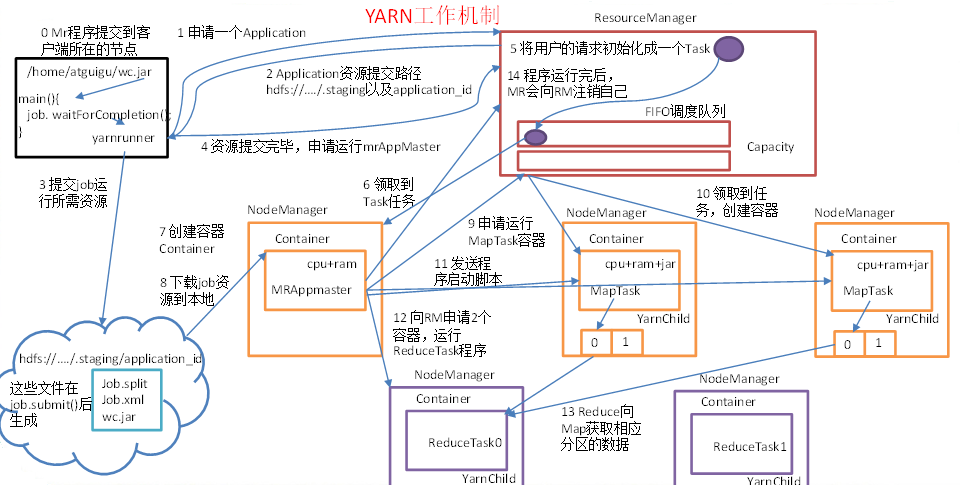

### 一、Linux

1. Linux常用命令
   * find df tar ps top netstat
2. CentOS查看版本
   * cat /etc/issue
3. Linux查看端口调用
   * netstat -anp|grep PORT
4. Linux命令查看内存、磁盘io、端口、进程
   * 查看内存: top
   * 查看磁盘存储情况: df -h
   * 查看端口: netstat -anp|grep PORT
   * 查看进程: ps aux 、 ps -ef
5. 使用Linux命令查询file1里面空行所在行
   * awk '/^$/{print NR}' file1
6. 文件中指定列的和并输出
   * awk -v sum=0 -F ""'{sum+=$2} END{print sum}' chengji.txt
7. 把Linux文件`/home/dim_city.txt`加载到hive内部表`dim_city`外部表中，HDFS路径为`/user/dim/dim_city`
```sql
-- 建表指定外部表类型为外部表，指定表的location属性
create external table dim_city(...) location '/user/dim/dim_city';
-- 加载数据
load data local inpath '/home/dim_city.txt' into table dim_city;
```
8. Shell脚本里如何检查文件是否存在，如果文件不存在该如何处理?Shell里如何检查一个变量是否是空?
```sh
if [-f file.txt];then
	echo "文件存在!"
else
	echo "文件不存在!"
fi
```
9. Shell脚本里如何统计一个目录下(包含子目录)有多少个java文件?如何取得每一个文件的名称(不包含路径)
   * ls -lR 目录名|grep ".java$"|wc -l
   * 获取文件名: basename path
<!-- TODO ??? -->

### 二、Hadoop入门
1. 简述apache的一个开源Hadoop的步骤
   * 根据Hadoop版本安装匹配JDK，配置`JAVA_HOME`
   * 解压安装Hadoop，配置`HADOOP_HOME`，将bin&sbin目录添加到PATH
   * 配置Hadoop的配置文件，hadoop-env.sh,yarn-env.sh,mapred-env.sh中添加环境`JAVA_HOME`，如果配置了~/.bashrc也可以不配置
   配置hdfs-site.xml,yarn-site.xml,mapred-site.xml,core-site.xml中添加必要配置(NN,2NN,YARN,tmp路径，压缩方式、副本个数、历史服务器、日志聚集等)
   * 对于完全分布式的集群，则需要配置所有及其的hosts映射信息，配置ResourceManager到其他及其的ssh免密登录
   * 在ResourceManager所在主机编辑`$HADOOP_HOME/etc/hadoop/slave`文件，配置集群中的所有主机名
   * 分发安装配置好的hadoop到其他节点
2. Hadoop中需要哪些配置文件，有什么作用
   * *-env.sh 文件为配置Hadoop各个组件运行的环境信息
   * core-site.xml 用户自定义核心组件，如NameNode所在rpc地址
<!-- TODO rpc ??? -->
   * hdfs-site.xml 用户自定义的hdfs相关参数
   * mapred-site.xml 用户自定义的mapreduce相关参数
   * yarn-site.xml 用户自定义和yarn相关的参数
3. 列出正常工作的Hadoop集群都分别启动哪些进程，简述他们的作用
   * ResourceManager 负责整个集群中所有计算资源(CPU、内存、IO、硬盘)的管理
   * NodeManager 负责单个节点中所有计算资源(CPU、内存、IO、硬盘)的管理，领取ResourceManager中的Task，分配container运行Task
   * NameNode 负责HDFS中元数据的管理和处理客户端的请求
   * DataNdde 以块为单位存储HDFS中的数据
   * SecondaryNameNode 帮助NameNode定期合并fsimage和edits文件，HA中可以省略此进程
4. 简述Hadoop中的默认端口和含义
   * 50070	NameNode的http服务端口
   * 9000		NameNode的接收客户端rpc调用端口<!-- TODO ??? -->
   * 8088		Yarn的http服务端口
   * 10888	MapReduce运行历史手机服务的http服务端口
   * 8042		NodeManager的http服务端口
### 三、Hadoop的HDFS
1. HDFS的存储机制(读写流程)
   ▼写流程
   * 1.客户端创建一个分布式文件系统客户端对象，向NN发送请求，请求上传文件
   * 2.NN处理请求，对请求进行合法性检查(权限，文件路径是否存在等)，验证请求合法后，响应客户端，通知写操作
   * 3.客户端创建一个输出流，输出流在写文件时，以块(128M)为单位，块又由packet(64k)作为基本单位，packet由多个chunk(512B+4B校验位)组成!
   * 4.开始第一块的上传，在上传时，会请求NN，根据网络拓扑距离，和上传的副本数，分配指定数量的距离客户端最近的DataNode节点列表
   * 5.客户端请求距离最近的一个DN建立通道，DN列表中的DN依次请求建立通道，全部通道建立完成，开始传输!客户端将一个块的0-128信息，以packet形式进行封装，将封装好的packe放入`data_queue`队列中，输出流在传输时，会建立一个`ack_queue`，将data_queue要传输的packet一次放入`ack_queue`中!
   * 6.客户端只负责当前的packet发送给距离最近的DN，DN会在收到packet后，向客户端的流对象发送ack命令，当ack_queue中的packet已经被所有的DN收到，那么在当前队列中就会删除次packet
   * 7.第一块上传完毕后，会上报NN，当前块已经发送到了哪些DN上!开始传输第二块(128M-...)，和第一块一样的流程
   * 8.当所有的数据都上传完毕，关闭流等待NN的一个响应
   ▼读流程
   * 1.客户端向NN发送请求，请求读取指定路径文件
   * 2.NN处理请求，返回当前文件的所有块列表信息
   * 3.客户端创建一个输入流，根据块的信息，从第一块开始读取，根据拓扑距离选择最近一个节点进行读取，剩余块一次读取
   * 4.所有块信息读取完毕，关流
2. SecondaryNameNode工作机制
   * 2NN和NN不是主从关系，2NN不是NN的热备，是两个不同的进程，2NN负责辅助NN工作，定期合并NN中产生的edits日志文件和fsimage镜像文件
   * 2NN基于连个触发条件，执行CheckPoint(合并)，每隔`dfs.namenode.checkpoint.period`秒合并一次，默认为1小时，每个`dfs.naemnode.checkpoint.txns`次合并一次，默认为100W，<!-- TODO ??? -->2NN默认每间隔60秒向NN发送请求，判断CheckPoint的条件是否满足，如果满足，向NN发送请求立刻滚动日志(产生一个新的日志，之后的操作都向新日志写入)，将历史日志和fsimage文件拷贝到2NN工作目录中，加载到内存进行合并，合并后，将新的fsimage文件传输给NN，覆盖老的fsimage文件
3. NameNode与SecondaryNameNode的区别和练习
   ▼联系
   * 2NN需要配合NN工作，NN启动，2NN工作才有意义
   * 2NN可能会保存部分和NN一致的元数据，可以用来NN的容灾回复
   ▼区别
   * 这是两个功能不同的进程，不是主备关系
4. 服役新节点和退役旧节点步骤
   * 服役新节点: 添加服务器、安装软件、配置环境、启动进程
   * 退役旧节点: 使用黑白名单
5. NameNode元数据损坏怎么办
   * 如果配置了NN的多目录配置，还可以照常启动
   * 如果多个目录的元数据都损坏，可以查看是否启用了HA，或者查看是否启用了2NN
   * 可以通过另外一个NN或者2NN中的元数据进行恢复
### 四、Hadoop的MapReduce
1. Hadoop的序列化和反序列化及自定义bean对象实现序列化
   * Hadoop中如果有reduce阶段，那么Mapper和Reducer中的key-value实现序列化
   * Hadoop采用的是自己的序列化机制(Writable机制)，是一种轻量级的序列化机制，储存的数据少，适合大数据量的网络传输
   * 无论是Map还是Reduce阶段，key-value需要实现Writable接口即可，重写readFiles()和writeFields()方法即可
2. FileInputFormat切片机制
   * 将输入目录中的所有文件，以文件单位进行切片
   * 根据isSplitable()方法，以文件的后缀名为依据，判断文件是否使用了压缩个格式，如果是普通文件则可切，否则判断是否是一个可切的压缩格式
   * 如果文件不可切，真个作为一片
   * 可切，确定每片的大小(默认是块大小)，之后以此大小为依据，循环进行切片
   * 除了最后一篇有可能时切片大小的1.1倍，其余每片切片大小为大小
 <!-- TODO 切片机制描述太模糊 -->
3. 自定义InputFormat流程
    继承InputFormat类，通常可以继承FileInputFormat以节省方法的实现
   * 如果需要实现自定义的切片逻辑，实现或重写createSplits()方法
   * 实现createRecordReader()方法，返回一个RecordReader对象
   * RecordReader负责将切片中的数据以key-value形式读入到Mapper中
   * 其核心方法是nextKeyValue()，这个方法负责读取一对key-value，读到则返回true，否则返回false
   * 可以根据需要实现isSplitable()方法
4. 如何决定一个job的map和reduce数量
   * maptask数量取决于切片数，可以通过调整切片的大小来控制map的数量
   * reducetask数量取决于Job.setNumReduceTasks()的值
5. MapTask工作机制
   * Map阶段: 使用InputFormat的RecordReader读取切片中的每一对key-value，每一对key-value都会调用mapper的map()处理
   * Sort阶段: 在Mapper和map()方法处理后，输出的key-value会先进行分区，之后被收集到缓冲区，当缓冲区达到一定的溢写阈值时,每个区的key-value会进行排序，之后溢写到磁盘，每次溢写的文件，最后会进行合并为一个总的文件，这个文件包含若干区，而且每个区内都是有序的
6. ReduceTask工作机制
   * copy阶段: ReduceTask启动Shuffle进程，到指定的maptask拷贝指定的数据，拷贝后会进行合并，合并成一个总的文件
   * sort阶段: 在合并时，保证所有的数据都是合并后有序的，所以会进行排序
   * reduce阶段: 在合并后的数据，会进行分组，每一组数据，调用Reducer的reduce()方法，之后的reduce通过OutputFormat的RecordWriter将数据输出
7. 请描述mapReduce有几种排序及排序发生的阶段
   * 两种排序: 快速排序、归并排序
   * MapTask阶段，每次溢写前进行快排，最后合并时进行归并排序
   * ReduceTask阶段，在sort和merge时使用归并排序
8. 请描述MapReduce中shuffle阶段的工作流程，如何优化shuffle阶段
   * 从Mapper的map()结束后到Reducer的reduce()开始前为shuffle
   * 工作流程 sort() --> copy() --> sort()
   * 优化:本质就是减少磁盘IO(减少溢写次数和每次溢写的数据量)和网络IO(减少网络数据传输量)
   >MapTask阶段优化
    map端减少一些次数，调大`mapreduce.task.io.sort.mn`和`mapreduce.map.sort.spill.percent`
    map端减少合并的次数，调大`io.sort.factor`
    在合适的情况下使用Combiner对数据在map端进行局部合并
    使用压缩，减少数据传输量

   >ReduceTask端优化
    reduce端减少溢写次数，调大`mapred.job.reduce.input.buffer.percent`

9. 请描述MapReduce中combiner的作用是什么，使用情景，哪些情况不需要，和reduce的区别
   * 作用是在每次溢写数据到磁盘时，对数据进行局部的合并，减少溢写数据量
   * 求和，汇总等场景适合使用，不是适合的场景例如求平均数
   * 和reduce的唯一区别，就是Combiner是运行在Shuffle阶段，且主要是MapTask端的shuffle阶段，而Reducer运行在reduce阶段
10. 如果没有定义partitioner，那数据在被送达Reducer前是如何被分区的
   * 如果ReduceTask个数为1，那么所有key-value都是0号区
   * 如果ReduceTask个数是大于1，默认使用HashPartitioner，根据key的hashCode()方法和Integer最大值做与运算，之后模除ReduceTask的个数
   * 所有数据的区号介于0和ReduceTask个数-1的范围内
11. MapReduce怎么实现TopN
    在Map端使数据根据排名字段进行排序
   * 合理设置Map的key，key中需要包含排序的字段
   * 通过时key实现WritableComparable接口或者自定义key的RawComparator类型比较器，归根到底，在排序时都是使用用户实现的compareTo()方法进行比较
    在Reduce端是输出数据
   * reduce端处理的数据已经自动排序完成，只需要控制输出N个key-value即可
12. 有可能使Hadoop任务输出到多个目录中么?如果可以怎么做?
   * 可以，通过自定义OutputFormat进行实现，核心时实现OutputFormat中的相关的RecordWriter，通过实现其write()方法就需要的数据输出到指定的目录
13. 简述Hadoop实现join的几种方法及每种方法的实现方法
   * ReduceJoin: 在Map阶段，对所有的输入文件进行组装，打标记输出，到reduce阶段，只处理啊需要join的字段，进行合并即可
   * MapJoin: 在Map阶段，将小文件以分布式缓存的形式进行存储，在Mapper的map()方法处理前，读取小文件的内容，和大文件进行合并即可，不需要有reduce阶段
14. 请简述hadoop怎样实现二级排序
   * key实现WritableComparable()接口，实现CompareTo()方法，先根据一个字段比较，如果当前字段相等继续按照另一个字段进行比较
15. 已知MapReduce场景为(HDFS文件块大小为64M，输出类型为FileInputFormat，有三个文件的大小分别时64k、65MB、127MB)，hadoop框架会把这些文件且多少片
   * 4片
16. Hadoop中RecordReader的作用是什么
   * 读取每一片中的记录为key-value，传给Mapper
17. 若有一个1G的数据文件，分别有id,name,mark,source四个字段，按照mark分组，id排序，减少排序的核心逻辑思路，其中启动几个MapTask
   * Map阶段key的比较器，使用根据mark和id进行二次排序
   * Reduce阶段分布比较器，根据mark进行比较，mark相同视为key相同
   * 默认启动8个MapTask
### 五、Hadoop的Yarn
1. 简述Hadoop1和Hadoop2的架构异同
   * Hadoop1使用JobTracker调度MR的运行
   * Hadoop2提供Yarn框架进行资源的调度
   * Hadoop2支持HA集群搭建
2. 为什么会产生Yarn，它解决了什么问题，有什么优势
   * Yarn为了将MR编程模型和资源的调度分层解耦
   * 使用Yarn后软件维护方便，Yarn还可以为其他的计算框架例如spark等提供资源的调度
3. MR作业提交全过程

4. HDFS的数据压缩算法
   * 系统内置: deflate、gzip、bzip2
   * 额外安装: lzo、snappy
   * 压缩率高: bzip2
   * 速度快:   snappy、lzo
   * 可切片的: lzo、bzip2
   * 使用麻烦: lzo
5. Hadoop调度器总结
   ▼FIFO调度器
   * 单队列
   * 按照job提交的顺序先进先出
   * 容易出现单个用的job独占资源，而其他的小job无法及时处理的问题
   ▼容量调度器
   * 多个队列，队列内部FIFO，内个队列可以指定容量
   * 资源利用率高，处理灵活，空闲队列的资源可以补充到繁忙队列
   * 可以设置单个用户的资源限制，防止单个用户独占资源
   * 动态调整，维护方便
   ▼公平调度器
   * 在容量调度器的基础上，改变了FIFO的调度策略
   * 默认参考集群中内存资源使用最大最小公平算法，保证小Job可以及时处理，大job不至于饿死，对小job有优势
6. MapReduce推测执行算法及原理
<!-- TODO 推荐执行算法配图 -->
### 六、Hadoop优化
1. MapReduce跑的慢的原因
   * Task运行申请的资源少，可以通过调节相关参数解决
   * 程序逻辑复杂，可以将复杂逻辑拆分为多个job，串行执行
   * 产生了数据倾斜，可以通过合理设置切片策略和设置分区及调节ReduceTask数量解决
   * Shuffle过程漫长，可以通过合理使用Combiner，使用压缩，调大Map端缓冲区大小等解决
2. MapReduce优化方法
<!-- TODO HadoopMapReduce第六章第2节 -->
3. HDFS小文件优化方法
   * 在源头处理，就小文件压缩和打包
   * 使用Har进行归档，Har归档后的文件只能节省NameNode的内存空间，在进行MapReduce计算时，依然以小文件的形式存在
   * 使用CombineTextInputFormat
   * 使用紧凑的文件格式，例如SequenceFile
4. MapReduce怎么解决数据均衡问题，如何确定分区号
   * Map端避免数据倾斜: 抽样数据，避免不可切分的数据，小文件过多，使用CombineTextInputFormat
   * Reduce端避免数据倾斜: 抽样数据，合理设置数据的分区，合理设置ReduceTask的个数
   * 使用Partitioner的getPartition()确定分区号
5. Hadoop中job和Task之间的区别是什么
   * 一个job在运行期间，会启动多个task来完成每个阶段的具体任务
### 七、ZooKeeper
1. 简述ZooKeeper的选举机制
   * 只有zookeeper以集群模式启动时，需要选举leader
   * 集群中leader再集群启动时，选举产生或者是leader挂掉，集群中的其他机器重新选举产生
   * 满足半数以上机制，按照启动顺序，id大的由优势
2. ZooKeeper的监听原理
   * 首先要有一个main()线程，在main线程中创建ZooKeeper客户端，这是就会创建两个线程，一个负责和ZooKeeper服务端通信(connet)，一个负责监听ZooKeeper服务端的通知(listener)
   * 通过connet线程将注册的监听事件发送给ZooKeeper
   * 在ZooKeeper的注册监听器列表中该客户端注册的监听事件添加到列表中
   * ZooKeeper监听到由数据和路径变化，通知listener线程
   * listener线程内部调用了Watcher的process()方法
3. ZooKeeper的部署方式有哪几种，集群中的角色有哪些，集群最少需要几台机器
   * standlone模式和集群模式
   * Leader和Follower
   * 2台
4. ZooKeeper常用的命令
   * ls、ls2、stat、get、create、set
### 八、Hive
1. Hive表关联查询，如何解决数据倾斜问题
   * 提前清洗数据，将不合法数据例如key为null的数据进行过滤
   * 如果没用清洗则再查询时先过滤再关联表
   * 如果数据中有很多数量级多的key，可以增加ReduceTask个数，避免多个大key集中到一个ReduceTask
   * 且将无意义的nullkey进行随机替换处理，同时增加ReducerTask的个数，以分散数据
   * 转换为mapjoin
   * 大key和其他数据分开处理
   * `hive.optimize.skewjoin`:将一个join sql分为连个job，另外可以同时设置下`hive.skewjoin.key`，默认为10000，参数对full outer join无效
   * 调整内存设置，适用于那些由于内存超限任务被kill掉的场景，通过加大内存起码能让任务跑起来，不至于被杀掉，该参数不一定会明显降低任务执行时间，如`setmapreduce.reduce.memory.mb=5120``setmapreduce.reduce.java.opts=-Xmx5000M -XX:MaxPermSize=128`
2. Hive的特点，Hive和RDBMS有什么异同
   * Hive的特点：基于OLAP设计的数据仓库软件，不适合实时计算，适合大数据量的计算，的层本质是MR
   * 和RDBMS的异同：异同为RDBMS为OLTP(事务，实时)，Hive为OLAP(分析，延迟)
   * 具体参考Hive文档第一章第4节
3. 说明Hive中Sort By，Order By，Cluster By，Distribute By各代表什么意思
   * Sort By：部分排序，一个Job有多个Reducer，每个Reducer处理的数据内部有序
   * Order By：全局排序，一个Job有一个Reducer
   * Distribute By：类似MR中partition，进行分区，结合sort by使用，Hive要求Distribute By语句要写在Sort By语句之前，即先分区再排序
   * Cluster By：当distribute by和sorts by字段相同时，可以使用cluster by方式，但是排序只能是升序排序，不能指定排序规则ASC或者DESC
4. Hive有哪些方式保存元数据，各有哪些特点
   * 默认存放在derby
   * 修改存储在其他的关系型数据库，如mysql,oracle,mss,postgresql
   * 通过使用thrift调用metaServer服务进行元数据读写
5. Hive内部表外部表的区别
   * 内部表也称为管理表，可以管理数据的生命周期，删除管理表，数据也会随之删除
   * 外部表，只删除表结构(元数据)
6. 写出将text.txt文件收入Hive中test表'2016-10-10'分区语句test的分区字段是`l_date`
   * `load data local inpath '/text.txt' into table test partition(l_date='2016-10-10');`
7. Hive自定义UDF函数的流程
   * 自定义一个java类，继承UDF类，重写一个互殴多个evaluate方法
   * evaluate()的返回值不能为void，可以是null
   * 打成jar包，在hive中使用add jar pathofjar 或者直接将jar包放在hive的liv目录中
   * 在hive中使用create function 函数名 as '主类名'声明函数
8. 对于Hive，你写过哪些udf函数，作用是什么
   * `dayofyear`,作用是返回当前日期是一年中的第几天
   * `base_analizer`
   * `flat_analizer`
9. Hive中的压缩格式TextFile，SequenceFile，RCFile，ORCFile各有什么区别
   * TextFile，默认格式，数据不做压缩，磁盘开销大，数据解析开销大，可结合压缩格式进行压缩
   * SequenceFile，是Hadoop API提供的一种二进制文件，它将数据以key-value对的形式序列化到文件中，这种二进制文件内部使用Hadoop标准的Writable接口实现序列化和反序列化，Hive中的SequenceFile继承自Hadoop API的SequenceFile，不过他的key为空，使用value存放实际的值，这样是为了避免MR在运行Map阶段的排序进程。
   * RCFile，是Hive推出的一种专门面向列的数据格式，它遵循"先排列划分，再垂直划分"的设计理念，在查询过程中，针对它并不关心的列时，它会在IO上跳过这些列，需要说明的是，RCFile在map阶段从远端拷贝仍然是拷贝整个数据块，并且拷贝到本地目录后RCFile并不是真正直接跳过不需要的列，并跳到需要读取的列，而是通过扫描每一个row group的头部定义来实现，但是整个HDFS Block级别的头部并没有定义每个列从哪个row group起始到哪个row group结束，所以在读取所有的情况下，RCFile的性能反而没有SequenceFile高。
   * ORCFile，是列式存储，有多种文件压缩方式，并且有着很高的压缩比，文件是不可切分(Split)的，因此，在Hive中使用ORC作为表的文件存储格式，不仅节省HDFS存储资源，查询任务的输入数据量减少，使用的MapTask也就减少了，提供了多种索引，row group index、bloom filter index。ORC可以支持复杂的数据结构(比如Map等)
10. Hive join过程中大表和小表的防止顺序
   * 小表join大表，当设置了`set hive.auto.convert.join=true`后，hive会自动调整顺序
11. Hive的两张表关联，使用MapReduce怎么实现
      ▼ReduceJoin
   * 在Map端使用了一个通用的bean来封装谁，这个bean中包含了两个表的所有字段
   * 在Map端处理时，为每个bean打上标记，标记当前数据的来源
   * 在Reduce端，根据数据的来源将数据分类
   * 在Reduce端进行字段的关联，且只处理需要处理的数据
      ▼MapJoin
   * 根据两张表的数据的数据量，将两张表划分为大表和小表
   * 小表使用分布式缓存提前缓存，大表作为MR的输入，进行切片后读入到MapTask
   * 在Mapper的map()方法处理之前，提前从分布式缓存中读取小表中的数据
   * 在Mapper的map()方法中，对大表的数据进行关联操作
12. 所有的Hive任务都会有MapReduce的执行吗
   * 取决于`hive.fetch.task.conversion`的配置，默认配置为more
   * 即当一个查询中只有select，where，包括带分区字段的过滤查询和limit走fetchtask，不走MR
13. Hive的函数:UDF、UDAF、UDTF的区别
   * UDF，用户定义函数，一进一出
   * UDAF，用户定义的聚集函数，多进一出
   * UDTF，用户定义的表生成函数，一进多出
14. Hive桶表的理解
   * 分桶也是分散数据，分桶的作用，可以按照字段将数据分散到多个文件
   * 可以使用抽样查询结合分桶操作，只选择指定的桶进行查询
15. Hive可以像关系型数据库那样建立多个库吗
   * 可以
16. Hive实现统计的查询语句是什么
   * count() max() avg() sum() main()
   * renk() row_number() ntile() dense_ran()
17. Hive优化措施
   * 在简单查询时使用fetchtask
   * 在测试和小文件的实验中，本地模式速度快
   * 能够使用Mapjoin尽量使用Mapjoin
   * 聚合操作如果数据量过大，开启map端集合，将原先的MR通过两个MR实现
```conf
hive.map.aggr=true
hive.groupby.mapaggr.checkinterval=100000
hive.groupby.skewindata=true
```
   * count(distinct)，在数据量过大时，可以先group by在执行count操作
   * 开启严格模式，避免无效的hql在执行
   * 行列过滤
```
行过滤:在查询时尽量先通过where将数据集的范围缩小，再进行关联等计算
列过滤:按需查询，避免select   * 
```
   * 在执行hive时，提前对数据进行抽样和调查，合理设置map和reduce个数避免数据倾斜
   * 在机器性能好的前提下，可以设置MR的并行执行
```conf
set hive.exec.parallel=true
set hive.exec.parallel.thread.number=16
```
   * 针对小文件过多造成的小任务过多，开启jvm重用`mapreduce.job.jvm.numtasks=10-20`
   * 在必要时更换hive的执行引擎，在tez或者spark上执行hql语句
18. Hive中，建的表为压缩表，但是输入文件为非压缩格式，会产生怎样的现象或者结果
   * 如果load加载数据，那么文件在上传列表中时依然为非压缩格式
   * 如果insert into的方式插入，那么会以压缩格式存在
19. 已知a是一张内部表，如何将它转换成外部表，请写出相应的hive语句
```sql
alter table a set tblproperties('EXTERNAL'='TRUE');
```
20. Hive中mapjoin的原理和实际应用
   * 同11 mapjoin的原理
   * 作用是为了避免出现子啊Reduce端的数据倾斜
21. 订单详情表ord_det(order_id订单号，sku_id商品编号，sale_qtty销售数量，dt日期分区)任务计算2016年1月1日商品销量的Top100，并按销量降级排序
    ```sql
    select sku_id,sum(sale_qtty) sum_sale
    from ord_det
    where dt=20160101
    group by sku_id
    order by sum_sale desc
    limit 100
    ```
22. 一个表STG.t_ORDER，有如下字段:OrderDate，Order_id，User_id，amount。请给出sql进行统计:数据样例:2017-01-01,10029028,1000003251,33.57。
    ```sql
    -- 1) 给出2017年每个月的订单数、用户数、总成交金额。
    select month(orderdate),count(order_id)ordercount,count(distinct user_id) userCount,sum(amount) sum
    from t_order
    where year(orderdate)=2017
    group by month(orderdate)
    -- 2) 给出2017年11月的新客数(指在11月才有第一笔订单)。
    select count(*)
    from
    (select  user_id,orderdate,order_id, lag(orderdate,1,'无') over(partition by user_id order by orderdate) last_orderdate
    from t_order)tmp
    where 
    ```
# 九、Flume
1. Flume有哪些组件，flume的source、channel、sink具体是做什么的
   * flume的组件有source，channel，sink，interceptor，channel selector，sink processor
   * source对接不通过的数据源，将数据封装为event，传输给channel
   * sink负责channel中获取event，将event写入到指定的目标
   * channel介于source和sink中的缓冲，负责临时存储event
2. 如何实现flume数据传输的监控
   * 使用ganglia来监控 <!-- TODO 实际没有使用ganglia -->
   * 或者使用Json Reporting将Flume的相关数据以json格式生成，交给前端进行可视化
   * 自定义监控类，继承MonitoredCounterGroup，来自定义监控的逻辑
3. Flume的source、sink、channel的作用，经常使用的source是什么类型
   * 使用taildir source监控一个实时写入的文件
   * 使用netcat source监控一个网络端口
4. Flume 的Channel Selectors
   * 默认为Replicating Channel Selector，它将event复制发送到所有的channel
   * Maltiplexing Channel Selector则根据event中指定的header信息，将event发送到指定的channel
5. Flume参数调优
   ▼Source
   * 增加source个数，使用taildir source时可以增加filegroups个数，增大source的读取能力，
   * batchsize参数决定了Source一次批量运输到Channel的event条数，适当调大这个参数可以提高Source搬运event到Channel时的性能
   ▼Channel
   * type选择memory时Channel的性能最好，但是如果Flume进程意外挂掉可能会丢失数据
   * type选择file时Channel的容错性最好，但是性能会比memory channel差
   * 使用Kafka Channel兼顾性能和安全
   * 使用file Channel时dataDirs配置多个不同盘写的目录可以提高性能
   * Capacity参数决定Channel可容纳最大的event条数，transactionCapacity参数决定每次source往channel里面写的最大event条数和每次sink从channel里面读的最大event条数，transactionCapacity需要大于source和sink的batchsize参数
   ▼Sink
   * 增加Sink的个数可以增加sink消费event的能力，sink也不是越多越好，够用就行，过多的sink会占用系统资源，造成系统资源不必要的浪费
   * batchSize参数决定Sink一次批量从Channel读取的event条数，适当调大这个参数可以提高Sink从Channel搬出event的性能
   * 使用Kafka Sink构建何科的数据流拓扑结构，提高数据并发消费能力。
6. Flume事务机制
   * event从source到channel为put事务，put事务在一批event被拦截器处理后，准备存储到channel时开启事务，全部存储完毕后提交事务，如果失败则回滚事务
   * event从channel到sink为take事务，同理，sink开始写入数据时开启事务，一批event被sink从channel中全部写入到指定目标提交事务，然后清楚在channel中存储的event发生异常时则回滚事务，保证event的安全。
7. Flume采集数据会丢失吗
   * 会
   * 使用exec source有丢失数据的风险
   * 使用memory channel会在agent故障时丢失阶段性数据
