<<<<<<< HEAD
# 一、概述
## 1.定义
**Apache Kylin**是一个开源的分布式分析引擎，提供Hadoop/Spark之上的SQL查询接口及多维分析(OLAP)能力以支持超大规模数据，最初由eBay开发并贡献至开源社区。它能在亚秒内查询巨大的Hive表，在即席查询方面应用广泛。

## 2.前置知识

Kylin术语
Data Warehouse(数据仓库)
Business Intelligence(商业智能)
OLAP(online analytical processing)
$2^n-1$种角度
OLAP Cube
MOLAP基于多维数据集，一个多维数据集称为一个OLAP Cube
预计算每个OLAP Cube
通过降维获取不同角度
Cuboid

OLAP中所有的Cube在Kylin中并称为Cube

维度建模
星形模型
事实表中必须有可度量字段，事实表中每条数据对应一个实际的事件
维度表，用于描述事件，单个字段对应的事件
雪花模型
在星星模型的基础上，每个维度表再划分
Dimension(维度) & Measure(度量)
分析数据的角度
被分析的数据

数仓表的同步类型
增量同步
全量同步，针对修改无法使用增量同步

## 3.Kylin架构

**数据源**(离线--Hive 实时--Kafka)
**底层运算**使用Spark(比mr快)
>**REST Server**
REST Server是一套面向应用程序开发的入口点，旨在实现针对Kylin平台的应用开发工作。 此类应用程序可以提供查询、获取结果、触发cube构建任务、获取元数据以及获取用户权限等等。另外可以通过Restful接口实现SQL查询，Rest集成了多种接口用于处理不同的请求。

>**查询引擎(Query Engine)**
当cube准备就绪后，查询引擎就能够获取并解析用户查询。它随后会与系统中的其它组件进行交互，从而向用户返回对应的结果。

>**路由器(Routing)**
用于查询没有预计算的维度，在最初设计时曾考虑过将Kylin不能执行的查询引导去Hive中继续执行，但在实践后发现Hive与Kylin的速度差异过大，导致用户无法对查询的速度有一致的期望，很可能大多数查询几秒内就返回结果了，而有些查询则要等几分钟到几十分钟，因此体验非常糟糕。最后这个路由功能在发行版中默认关闭。

>**元数据管理工具(Metadata)**
Kylin是一款元数据驱动型应用程序。元数据管理工具是一大关键性组件，用于对保存在Kylin当中的所有元数据进行管理，其中包括最为重要的cube元数据。其它全部组件的正常运作都需以元数据管理工具为基础。 Kylin的元数据存储在hbase中。

>**任务引擎(Cube Build Engine)**
这套引擎的设计目的在于处理所有离线任务，其中包括shell脚本、Java API以及Map Reduce任务等等。任务引擎对Kylin当中的全部任务加以管理与协调，从而确保每一项任务都能得到切实执行并解决其间出现的故障。

## 4.特点
>**标准SQL接口**
即便Kylin不基于关系型数据库，仍具备标准的SQL结构

>**支持超大数据集**
Kylin对于大数据的支撑能力可能是目前所有技术中最为领先的。早在2015年eBay的生产环境中就能支持百亿记录的秒级查询，之后在移动的应用场景中又有了千亿记录秒级查询的案例

>**亚秒级响应**
Kylin拥有优异的查询相应速度，这点得益于预计算，很多复杂的计算，比如连接、聚合，在离线的预计算过程中就已经完成，这大大降低了查询时刻所需的计算量，提高了响应速度

>**可伸缩性和高吞吐率**
单节点Kylin可实现每秒70个查询，还可以搭建Kylin的集群

>**BI工具集成**
Kylin可以与现有的BI工具集成，具体包括如下内容。
ODBC：与Tableau、Excel、PowerBI等工具集成
JDBC：与Saiku、BIRT等Java工具集成
RestAPI：与JavaScript、Web网页集成
Kylin开发团队还贡献了**Zepplin**的插件，也可以使用Zepplin来访问Kylin服务

# 二、环境搭建
[**官网地址**http://kylin.apache.org/cn/](http://kylin.apache.org/cn/)
[**官方文档**http://kylin.apache.org/cn/docs/](http://kylin.apache.org/cn/docs/)
[**下载地址**http://kylin.apache.org/cn/download/](http://kylin.apache.org/cn/download/)
```bash
# 解压
tar -zxvf apache-kylin-2.5.1-bin-hbase1x.tar.gz -C /opt/module/
# 使用Kylin需要配置HADOOP_HOME,HIVE_HOME,HBASE_HOME，并添加PATH
# 先启动hdsf,yarn,historyserver,zk,hbase
start-dfs.sh # hadoop101
start-yarn.sh # hadoop102
mr-jobhistoryserver.sh start historyserver # hadoop101
start-zk # shell
start-hbase.sh
jpsall # 查看所有进程
# --------------------- hadoop101 ----------------
# 3360 JobHistoryServer
# 31425 HMaster
# 3282 NodeManager
# 3026 DataNode
# 53283 Jps
# 2886 NameNode
# 44007 RunJar
# 2728 QuorumPeerMain
# 31566 HRegionServer
# --------------------- hadoop102 ----------------
# 5040 HMaster
# 2864 ResourceManager
# 9729 Jps
# 2657 QuorumPeerMain
# 4946 HRegionServer
# 2979 NodeManager
# 2727 DataNode
# --------------------- hadoop103 ----------------
# 4688 HRegionServer
# 2900 NodeManager
# 9848 Jps
# 2636 QuorumPeerMain
# 2700 DataNode
# 2815 SecondaryNameNode
```
[**Web页面**http://hadoop101:7070/kylin/](http://hadoop101:7070/kylin/)

# 三、具体使用

## 1.数据准备
```sql
# 建表 user_info
create external table user_info(
id string,
user_name string,
gender string,
user_level string,
area string
)
partitioned by (dt string)
row format delimited fields terminated by "\t";

# payment_info
create external table payment_info(
id string,
user_id string,
payment_way string,
payment_amount double
)
partitioned by (dt string)
row format delimited fields terminated by "\t";

# 插入数据
load data local inpath "/opt/module/datas/user_0101.txt" overwrite into table user_info partition(dt='2019-01-01');
load data local inpath "/opt/module/datas/user_0102.txt" overwrite into table user_info partition(dt='2019-01-02');
load data local inpath "/opt/module/datas/user_0103.txt" overwrite into table user_info partition(dt='2019-01-03');

load data local inpath "/opt/module/datas/payment_0101.txt" overwrite into table payment_info partition(dt='2019-01-01');
load data local inpath "/opt/module/datas/payment_0102.txt" overwrite into table payment_info partition(dt='2019-01-02');
load data local inpath "/opt/module/datas/payment_0103.txt" overwrite into table payment_info partition(dt='2019-01-03');
```
## 2.项目创建
[**Web页面**http://hadoop101:7070/kylin/](http://hadoop101:7070/kylin/)
**用户名**:ADMIN
**密码**:KYLIN

## 3.创建Module


## 4.创建Cube


## 5.使用进阶

### 5.1 每日全量维度表
按照上述流程创建项目时会出现报错`USER_INFO Dup key found`
**报错原因**
module中的多维度表(user_info)为每日全量表，使用整张表作为维度表，必然会出现同一个user_id对应多条数据的问题
>**解决方案一**
在hive中创建维度表的临时表，该临时表中存放前一天的分区数据，在kylin中创建模型时选择该临时表作为维度表

>**解决方案二**
使用视图(view)实现方案一的效果
```sql
# 创建维度表视图(视图获取前一天分区的数据)，
create view user_info_view as select * from user_info where dt=date_add(current_date,-1);
# 本案例日期为确定值
create view user_info_view as select * from user_info where dt=2019-1-1;
# 创建视图后在DataSource中重新导入，并创建项目(module,cube)
# 查询数据
select u.user_level, sum(p.payment_amount)
from payment_info p
join user_info_view
on p.user_id = u.id
group by u.user_level;
```
### 5.1 编写脚本自动创建Cube
**build cube**
```sh
#! /bin/bash
cube_name=payment_view_cube
do_date=`date -d '-1 day' +%F`

#获取00:00时间戳，Kylin默认零时区，改为东八区
start_date_unix=`date -d "$do_date 08:00:00" +%s`
start_date=$(($start_date_unix*1000))

#获取24:00的时间戳
stop_date=$(($start_date+86400000))

curl -X PUT -H "Authorization: Basic QURNSU46S1lMSU4=" -H 'Content-Type: application/json' -d '{"startTime":'$start_date', "endTime":'$stop_date', "buildType":"BUILD"}' http://hadoop101:7070/kylin/api/cubes/$cube_name/build
```

# 四、Cube构建原理

HBase rowKey
Cuboid id + 维度值

Kylin根据任务复杂度和资源自动决定构建算法

# 五、Cube构建优化
**Cube构建优化**
尽可能减少Cuboid个数

**衍生维度原理**
通过衍生关系减少Cuboid个数，
不使用真正的维度构建，使用外键维度构建，
在查询后通过函数(衍生)关系计算结果，
当有多个结果时，再增加一次聚合，
即牺牲查询效率，增加构建效率
事实表中必须有字段(外键)通过函数关系确定维度表中的字段
这个函数关系称为衍生关系

**使用聚合组**
>**强制维度**
必须带有指定字段作为维度
A,B,C中最终确定了，A,AB,AC,ABC四个维度

>**联合维度**
必须把某些字段作为一个整体确定维度
A,B,C中把BC,作为整体，确定了
A,ABC,BC三个维度

>**层级维度**
A>B>C的层级关系，
维度中有低等级出现时，比它等级高的所有字段必须出现
确定维度为A,AB,ABC
如年，月，日字段
有价值的维度为年，年月，年月日

**Row Key优化**
>**被用作where过滤条件的维度放在前边**
HBase中的rowKey是按照字典顺序排列，
* 拖动web界面中拖动rowKey即可调整

>**基数大的维度放在基数小的维度前边**
根据Cuboid id确定基数大小，基数小的放在后面可以增加聚合度
因为HBase中Compaction

**并发粒度优化**
Kylin把任务转发到HBase，
在HBase中Region个数决定了并发度
通过调整`keylin.hbase.region.cut`的值决定并发

调整`kylin.hbase.region.count.min`实现预分区效果
`kylin.hbase.region.count.max`

# 六、BI工具集成

**JDBC**
```xml
<dependencies>
    <dependency>
        <groupId>org.apache.kylin</groupId>
        <artifactId>kylin-jdbc</artifactId>
        <version>2.5.1</version>
    </dependency>
</dependencies>
```
```java
package com.atguigu;

import java.sql.*;

public class TestKylin {

    public static void main(String[] args) throws Exception {

        //Kylin_JDBC 驱动
        String KYLIN_DRIVER = "org.apache.kylin.jdbc.Driver";
        //Kylin_URL，FirstProject替换为相互名
        String KYLIN_URL = "jdbc:kylin://hadoop101:7070/FirstProject";
        //Kylin的用户名
        String KYLIN_USER = "ADMIN";
        //Kylin的密码
        String KYLIN_PASSWD = "KYLIN";
        //添加驱动信息
        Class.forName(KYLIN_DRIVER);
        //获取连接
        Connection connection = DriverManager.getConnection(KYLIN_URL, KYLIN_USER, KYLIN_PASSWD);
        //预编译SQL
        PreparedStatement ps = connection.prepareStatement("SELECT sum(sal) FROM emp group by deptno");
        //执行查询
        ResultSet resultSet = ps.executeQuery();
        //遍历打印
        while (resultSet.next()) {
            System.out.println(resultSet.getInt(1));
        }
    }
}
```

**Zepplin**
```bash
tar -zxvf zeppelin-0.8.0-bin-all.tgz -C /opt/module/
mv zeppelin-0.8.0-bin-all/ zeppelin
bin/zeppelin-daemon.sh start
```
[Zepplin Web界面http://hadoop101:8080](http://hadoop101:8080)

=======
# 一、概述
## 1.定义
**Apache Kylin**是一个开源的分布式分析引擎，提供Hadoop/Spark之上的SQL查询接口及多维分析(OLAP)能力以支持超大规模数据，最初由eBay开发并贡献至开源社区。它能在亚秒内查询巨大的Hive表，在即席查询方面应用广泛。

## 2.前置知识

Kylin术语
Data Warehouse(数据仓库)
Business Intelligence(商业智能)
OLAP(online analytical processing)
$2^n-1$种角度
OLAP Cube
MOLAP基于多维数据集，一个多维数据集称为一个OLAP Cube
预计算每个OLAP Cube
通过降维获取不同角度
Cuboid

OLAP中所有的Cube在Kylin中并称为Cube

维度建模
星形模型
事实表中必须有可度量字段，事实表中每条数据对应一个实际的事件
维度表，用于描述事件，单个字段对应的事件
雪花模型
在星星模型的基础上，每个维度表再划分
Dimension(维度) & Measure(度量)
分析数据的角度
被分析的数据

数仓表的同步类型
增量同步
全量同步，针对修改无法使用增量同步

## 3.Kylin架构

**数据源**(离线--Hive 实时--Kafka)
**底层运算**使用Spark(比mr快)
>**REST Server**
REST Server是一套面向应用程序开发的入口点，旨在实现针对Kylin平台的应用开发工作。 此类应用程序可以提供查询、获取结果、触发cube构建任务、获取元数据以及获取用户权限等等。另外可以通过Restful接口实现SQL查询，Rest集成了多种接口用于处理不同的请求。

>**查询引擎(Query Engine)**
当cube准备就绪后，查询引擎就能够获取并解析用户查询。它随后会与系统中的其它组件进行交互，从而向用户返回对应的结果。

>**路由器(Routing)**
用于查询没有预计算的维度，在最初设计时曾考虑过将Kylin不能执行的查询引导去Hive中继续执行，但在实践后发现Hive与Kylin的速度差异过大，导致用户无法对查询的速度有一致的期望，很可能大多数查询几秒内就返回结果了，而有些查询则要等几分钟到几十分钟，因此体验非常糟糕。最后这个路由功能在发行版中默认关闭。

>**元数据管理工具(Metadata)**
Kylin是一款元数据驱动型应用程序。元数据管理工具是一大关键性组件，用于对保存在Kylin当中的所有元数据进行管理，其中包括最为重要的cube元数据。其它全部组件的正常运作都需以元数据管理工具为基础。 Kylin的元数据存储在hbase中。

>**任务引擎(Cube Build Engine)**
这套引擎的设计目的在于处理所有离线任务，其中包括shell脚本、Java API以及Map Reduce任务等等。任务引擎对Kylin当中的全部任务加以管理与协调，从而确保每一项任务都能得到切实执行并解决其间出现的故障。

## 4.特点
>**标准SQL接口**
即便Kylin不基于关系型数据库，仍具备标准的SQL结构

>**支持超大数据集**
Kylin对于大数据的支撑能力可能是目前所有技术中最为领先的。早在2015年eBay的生产环境中就能支持百亿记录的秒级查询，之后在移动的应用场景中又有了千亿记录秒级查询的案例

>**亚秒级响应**
Kylin拥有优异的查询相应速度，这点得益于预计算，很多复杂的计算，比如连接、聚合，在离线的预计算过程中就已经完成，这大大降低了查询时刻所需的计算量，提高了响应速度

>**可伸缩性和高吞吐率**
单节点Kylin可实现每秒70个查询，还可以搭建Kylin的集群

>**BI工具集成**
Kylin可以与现有的BI工具集成，具体包括如下内容。
ODBC：与Tableau、Excel、PowerBI等工具集成
JDBC：与Saiku、BIRT等Java工具集成
RestAPI：与JavaScript、Web网页集成
Kylin开发团队还贡献了**Zepplin**的插件，也可以使用Zepplin来访问Kylin服务

# 二、环境搭建
[**官网地址**http://kylin.apache.org/cn/](http://kylin.apache.org/cn/)
[**官方文档**http://kylin.apache.org/cn/docs/](http://kylin.apache.org/cn/docs/)
[**下载地址**http://kylin.apache.org/cn/download/](http://kylin.apache.org/cn/download/)
```bash
# 解压
tar -zxvf apache-kylin-2.5.1-bin-hbase1x.tar.gz -C /opt/module/
# 使用Kylin需要配置HADOOP_HOME,HIVE_HOME,HBASE_HOME，并添加PATH
# 先启动hdsf,yarn,historyserver,zk,hbase
start-dfs.sh # hadoop101
start-yarn.sh # hadoop102
mr-jobhistoryserver.sh start historyserver # hadoop101
start-zk # shell
start-hbase.sh
jpsall # 查看所有进程
# --------------------- hadoop101 ----------------
# 3360 JobHistoryServer
# 31425 HMaster
# 3282 NodeManager
# 3026 DataNode
# 53283 Jps
# 2886 NameNode
# 44007 RunJar
# 2728 QuorumPeerMain
# 31566 HRegionServer
# --------------------- hadoop102 ----------------
# 5040 HMaster
# 2864 ResourceManager
# 9729 Jps
# 2657 QuorumPeerMain
# 4946 HRegionServer
# 2979 NodeManager
# 2727 DataNode
# --------------------- hadoop103 ----------------
# 4688 HRegionServer
# 2900 NodeManager
# 9848 Jps
# 2636 QuorumPeerMain
# 2700 DataNode
# 2815 SecondaryNameNode
```
[**Web页面**http://hadoop101:7070/kylin/](http://hadoop101:7070/kylin/)

# 三、具体使用

## 1.数据准备
```sql
# 建表 user_info
create external table user_info(
id string,
user_name string,
gender string,
user_level string,
area string
)
partitioned by (dt string)
row format delimited fields terminated by "\t";

# payment_info
create external table payment_info(
id string,
user_id string,
payment_way string,
payment_amount double
)
partitioned by (dt string)
row format delimited fields terminated by "\t";

# 插入数据
load data local inpath "/opt/module/datas/user_0101.txt" overwrite into table user_info partition(dt='2019-01-01');
load data local inpath "/opt/module/datas/user_0102.txt" overwrite into table user_info partition(dt='2019-01-02');
load data local inpath "/opt/module/datas/user_0103.txt" overwrite into table user_info partition(dt='2019-01-03');

load data local inpath "/opt/module/datas/payment_0101.txt" overwrite into table payment_info partition(dt='2019-01-01');
load data local inpath "/opt/module/datas/payment_0102.txt" overwrite into table payment_info partition(dt='2019-01-02');
load data local inpath "/opt/module/datas/payment_0103.txt" overwrite into table payment_info partition(dt='2019-01-03');
```
## 2.项目创建
[**Web页面**http://hadoop101:7070/kylin/](http://hadoop101:7070/kylin/)
**用户名**:ADMIN
**密码**:KYLIN

## 3.创建Module


## 4.创建Cube


## 5.使用进阶

### 5.1 每日全量维度表
按照上述流程创建项目时会出现报错`USER_INFO Dup key found`
**报错原因**
module中的多维度表(user_info)为每日全量表，使用整张表作为维度表，必然会出现同一个user_id对应多条数据的问题
>**解决方案一**
在hive中创建维度表的临时表，该临时表中存放前一天的分区数据，在kylin中创建模型时选择该临时表作为维度表

>**解决方案二**
使用视图(view)实现方案一的效果
```sql
# 创建维度表视图(视图获取前一天分区的数据)，
create view user_info_view as select * from user_info where dt=date_add(current_date,-1);
# 本案例日期为确定值
create view user_info_view as select * from user_info where dt=2019-1-1;
# 创建视图后在DataSource中重新导入，并创建项目(module,cube)
# 查询数据
select u.user_level, sum(p.payment_amount)
from payment_info p
join user_info_view
on p.user_id = u.id
group by u.user_level;
```
### 5.1 编写脚本自动创建Cube
**build cube**
```sh
#! /bin/bash
cube_name=payment_view_cube
do_date=`date -d '-1 day' +%F`

#获取00:00时间戳，Kylin默认零时区，改为东八区
start_date_unix=`date -d "$do_date 08:00:00" +%s`
start_date=$(($start_date_unix*1000))

#获取24:00的时间戳
stop_date=$(($start_date+86400000))

curl -X PUT -H "Authorization: Basic QURNSU46S1lMSU4=" -H 'Content-Type: application/json' -d '{"startTime":'$start_date', "endTime":'$stop_date', "buildType":"BUILD"}' http://hadoop101:7070/kylin/api/cubes/$cube_name/build
```

# 四、Cube构建原理
## 1.Cube存储原理

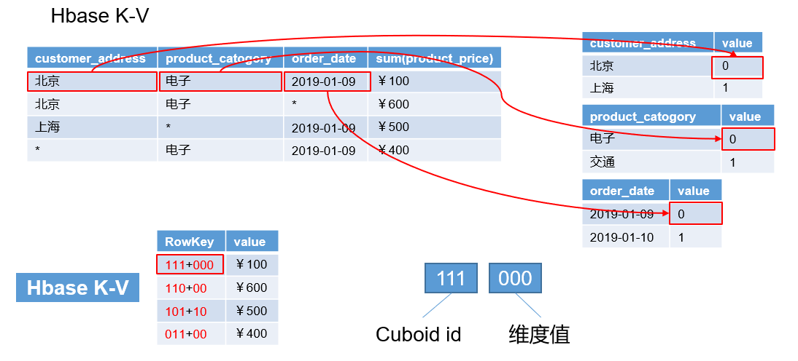
HBase rowKey
Cuboid id + 维度值

## 2.Cube构建算法
### 2.1 逐层构建算法(layer)
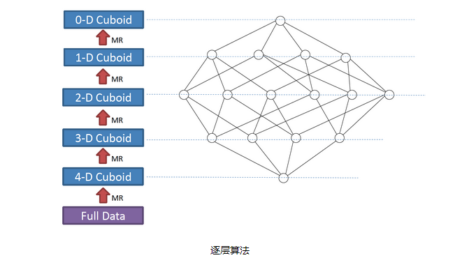
我们知道，一个N维的Cube，是由1个N维子立方体、N个(N-1)维子立方体、N*(N-1)/2个(N-2)维子立方体、......、N个1维子立方体和1个0维子立方体构成，总共有2^N个子立方体组成，在逐层算法中，按维度数逐层减少来计算，每个层级的计算（除了第一层，它是从原始数据聚合而来），是基于它上一层级的结果来计算的。比如，[Group by A, B]的结果，可以基于[Group by A, B, C]的结果，通过去掉C后聚合得来的；这样可以减少重复计算；当 0维度Cuboid计算出来的时候，整个Cube的计算也就完成了。
每一轮的计算都是一个MapReduce任务，且串行执行；一个N维的Cube，至少需要N次MapReduce Job。
>**算法优点**
> * 此算法充分利用了MapReduce的优点，处理了中间复杂的排序和shuffle工作，故而算法代码清晰简单，易于维护；
> * 受益于Hadoop的日趋成熟，此算法非常稳定，即便是集群资源紧张时，也能保证最终能够完成。

>**算法缺点**
> * 当Cube有比较多维度的时候，所需要的MapReduce任务也相应增加；由于Hadoop的任务调度需要耗费额外资源，特别是集群较庞大的时候，反复递交任务造成的额外开销会相当可观；
> * 由于Mapper逻辑中并未进行聚合操作，所以每轮MR的shuffle工作量都很大，导致效率低下。
> * 对HDFS的读写操作较多：由于每一层计算的输出会用做下一层计算的输入，这些Key-Value需要写到HDFS上；当所有计算都完成后，Kylin还需要额外的一轮任务将这些文件转成HBase的HFile格式，以导入到HBase中去；

*总体而言，该算法的效率较低，尤其是当Cube维度数较大的时候。*

### 2.2 快速构建算法(inmem)

也被称作“逐段”(By Segment) 或“逐块”(By Split) 算法，从1.5.x开始引入该算法，该算法的主要思想是，每个Mapper将其所分配到的数据块，计算成一个完整的小Cube 段（包含所有Cuboid）。每个Mapper将计算完的Cube段输出给Reducer做合并，生成大Cube，也就是最终结果。
与旧算法相比，快速算法主要有两点不同：
* Mapper会利用内存做预聚合，算出所有组合；Mapper输出的每个Key都是不同的，这样会减少输出到Hadoop MapReduce的数据量，Combiner也不再需要
* 一轮MapReduce便会完成所有层次的计算，减少Hadoop任务的调配。

**Kylin根据任务复杂度和资源自动决定构建算法**

# 五、Cube构建优化
从之前章节的介绍可以知道，在没有采取任何优化措施的情况下，Kylin会对每一种维度的组合进行预计算，每种维度的组合的预计算结果被称为Cuboid。假设有4个维度，我们最终会有24 =16个Cuboid需要计算。
但在现实情况中，用户的维度数量一般远远大于4个。假设用户有10 个维度，那么没有经过任何优化的Cube就会存在210 =1024个Cuboid；而如果用户有20个维度，那么Cube中总共会存在220 =1048576个Cuboid。虽然每个Cuboid的大小存在很大的差异，但是单单想到Cuboid的数量就足以让人想象到这样的Cube对构建引擎、存储引擎来说压力有多么巨大。因此，在构建维度数量较多的Cube时，尤其要注意Cube的剪枝优化（即==减少Cuboid的生成==）。

## 1.使用衍生维度(derived dimension)
衍生维度用于在有效维度内将维度表上的非主键维度排除掉，并使用维度表的主键（其实是事实表上相应的外键）来替代它们。Kylin会在底层记录维度表主键与维度表其他维度之间的映射关系，以便在查询时能够动态地将维度表的主键“翻译”成这些非主键维度，并进行实时聚合。
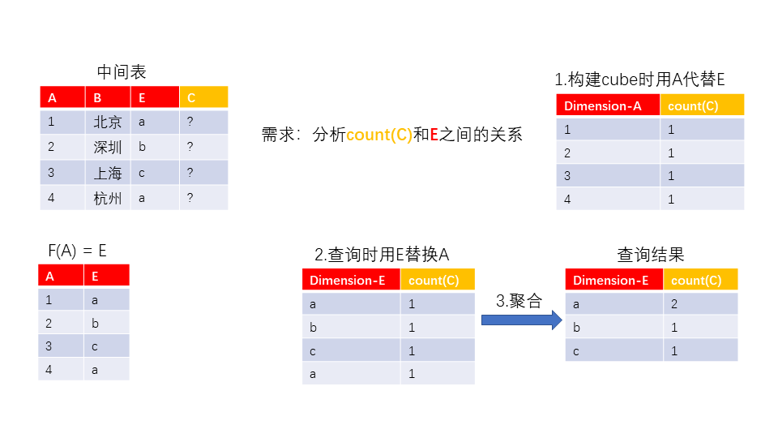
虽然衍生维度具有非常大的吸引力，但这也并不是说所有维度表上的维度都得变成衍生维度，如果从维度表主键到某个维度表维度所需要的聚合工作量非常大，则不建议使用衍生维度
**衍生维度原理**
通过衍生关系减少Cuboid个数，
不使用真正的维度构建，使用外键维度构建，
在查询后通过函数(衍生)关系计算结果，
当有多个结果时，再增加一次聚合，
即牺牲查询效率，增加构建效率
事实表中必须有字段(外键)通过函数关系确定维度表中的字段
这个函数关系称为衍生关系


## 2.使用聚合组
聚合组（Aggregation Group）是一种强大的剪枝工具。聚合组假设一个Cube的所有维度均可以根据业务需求划分成若干组（当然也可以是一个组），由于同一个组内的维度更可能同时被同一个查询用到，因此会表现出更加紧密的内在关联。每个分组的维度集合均是Cube所有维度的一个子集，不同的分组各自拥有一套维度集合，它们可能与其他分组有相同的维度，也可能没有相同的维度。每个分组各自独立地根据自身的规则贡献出一批需要被物化的Cuboid，所有分组贡献的Cuboid的并集就成为了当前Cube中所有需要物化的Cuboid的集合。不同的分组有可能会贡献出相同的Cuboid，构建引擎会察觉到这点，并且保证每一个Cuboid无论在多少个分组中出现，它都只会被物化一次。

### 2.1 强制维度(Mandatory)
如果一个维度被定义为强制维度，那么这个分组产生的所有Cuboid中每一个Cuboid都会包含该维度。每个分组中都可以有0个、1个或多个强制维度。如果根据这个分组的业务逻辑，则相关的查询一定会在过滤条件或分组条件中，因此可以在该分组中把该维度设置为强制维度。
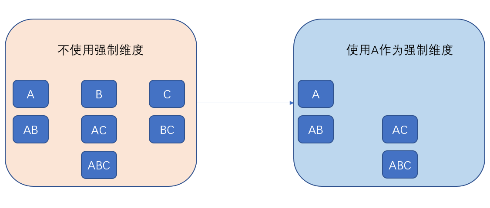
必须带有指定字段作为维度
A,B,C中最终确定了，A,AB,AC,ABC四个维度

### 2.2 层级维度(Hierarchy)
每个层级包含两个或更多个维度。假设一个层级中包含D1，D2…Dn这n个维度，那么在该分组产生的任何Cuboid中， 这n个维度只会以（），（D1），（D1，D2）…（D1，D2…Dn）这n+1种形式中的一种出现。每个分组中可以有0个、1个或多个层级，不同的层级之间不应当有共享的维度。如果根据这个分组的业务逻辑，则多个维度直接存在层级关系，因此可以在该分组中把这些维度设置为层级维度
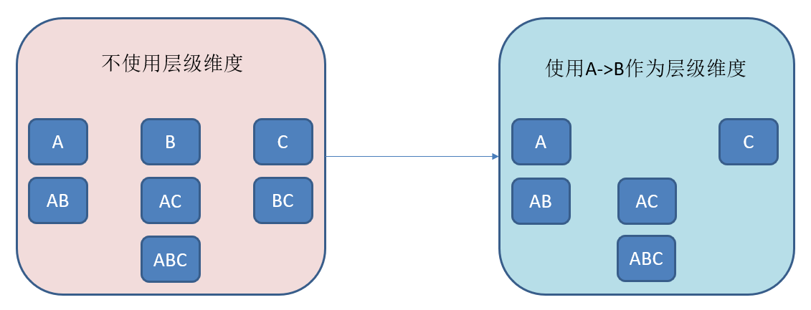
A>B>C的层级关系，
维度中有低等级出现时，比它等级高的所有字段必须出现
确定维度为A,AB,ABC
如年，月，日字段
有价值的维度为年，年月，年月日

### 2.3 联合维度(Joint)
每个联合中包含两个或更多个维度，如果某些列形成一个联合，那么在该分组产生的任何Cuboid中，这些联合维度要么一起出现，要么都不出现。每个分组中可以有0个或多个联合，但是不同的联合之间不应当有共享的维度（否则它们可以合并成一个联合）。如果根据这个分组的业务逻辑，多个维度在查询中总是同时出现，则可以在该分组中把这些维度设置为联合维度
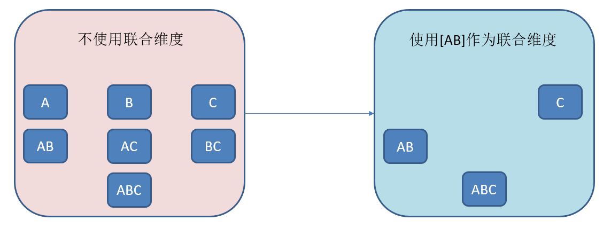
必须把某些字段作为一个整体确定维度
A,B,C中把BC,作为整体，确定了
A,ABC,BC三个维度

## 3.Row Key优化
Kylin会把所有的维度按照顺序组合成一个完整的Rowkey，并且按照这个Rowkey升序排列Cuboid中所有的行。
设计良好的Rowkey将更有效地完成数据的查询过滤和定位，减少IO次数，提高查询速度，维度在rowkey中的次序，对查询性能有显著的影响。

>**被用作where过滤条件的维度放在前边**
HBase中的rowKey是按照字典顺序排列，
* 拖动web界面中拖动rowKey即可调整

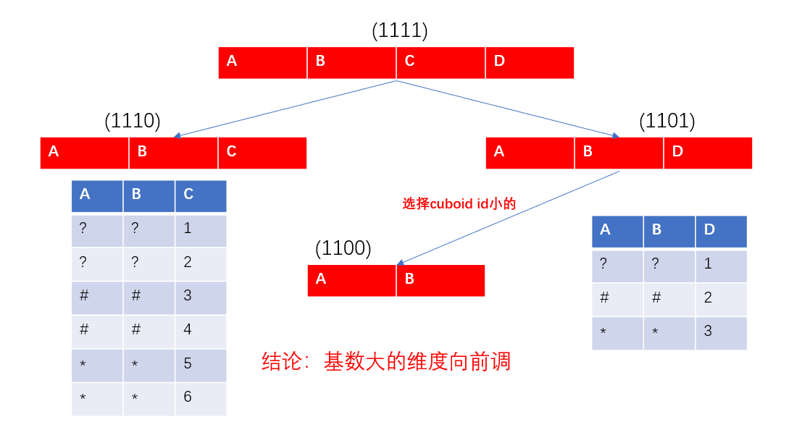
>**基数大的维度放在基数小的维度前边**
根据Cuboid id确定基数大小，基数小的放在后面可以增加聚合度
因为HBase中Compaction

## 4.并发粒度优化
当Segment中某一个Cuboid的大小超出一定的阈值时，系统会将该Cuboid的数据分片到多个分区中，以实现Cuboid数据读取的并行化，从而优化Cube的查询速度。具体的实现方式如下：构建引擎根据Segment估计的大小，以及参数“kylin.hbase.region.cut”的设置决定Segment在存储引擎中总共需要几个分区来存储，如果存储引擎是HBase，那么分区的数量就对应于HBase中的Region数量。kylin.hbase.region.cut的默认值是5.0，单位是GB，也就是说对于一个大小估计是50GB的Segment，构建引擎会给它分配10个分区。用户还可以通过设置kylin.hbase.region.count.min（默认为1）和kylin.hbase.region.count.max（默认为500）两个配置来决定每个Segment最少或最多被划分成多少个分区。

由于每个Cube的并发粒度控制不尽相同，因此建议在Cube Designer 的Configuration Overwrites（上图所示）中为每个Cube量身定制控制并发粒度的参数。假设将把当前Cube的kylin.hbase.region.count.min设置为2，kylin.hbase.region.count.max设置为100。这样无论Segment的大小如何变化，它的分区数量最小都不会低于2，最大都不会超过100。相应地，这个Segment背后的存储引擎（HBase）为了存储这个Segment，也不会使用小于两个或超过100个的分区。我们还调整了默认的kylin.hbase.region.cut，这样50GB的Segment基本上会被分配到50个分区，相比默认设置，我们的Cuboid可能最多会获得5倍的并发量。

Kylin把任务转发到HBase，
在HBase中Region个数决定了并发度
通过调整`keylin.hbase.region.cut`的值决定并发

调整`kylin.hbase.region.count.min`实现预分区效果
`kylin.hbase.region.count.max`

# 六、BI工具集成
可以与Kylin结合使用的可视化工具很多，例如：
ODBC：与Tableau、Excel、PowerBI等工具集成
JDBC：与Saiku、BIRT等Java工具集成
RestAPI：与JavaScript、Web网页集成
Kylin开发团队还贡献了Zepplin的插件，也可以使用Zepplin来访问Kylin服务。

## 1.JDBC
```xml
<dependencies>
    <dependency>
        <groupId>org.apache.kylin</groupId>
        <artifactId>kylin-jdbc</artifactId>
        <version>2.5.1</version>
    </dependency>
</dependencies>
```
```java
package com.atguigu;

import java.sql.*;

public class TestKylin {

    public static void main(String[] args) throws Exception {

        //Kylin_JDBC 驱动
        String KYLIN_DRIVER = "org.apache.kylin.jdbc.Driver";
        //Kylin_URL，FirstProject替换为相互名
        String KYLIN_URL = "jdbc:kylin://hadoop101:7070/FirstProject";
        //Kylin的用户名
        String KYLIN_USER = "ADMIN";
        //Kylin的密码
        String KYLIN_PASSWD = "KYLIN";
        //添加驱动信息
        Class.forName(KYLIN_DRIVER);
        //获取连接
        Connection connection = DriverManager.getConnection(KYLIN_URL, KYLIN_USER, KYLIN_PASSWD);
        //预编译SQL
        PreparedStatement ps = connection.prepareStatement("SELECT sum(sal) FROM emp group by deptno");
        //执行查询
        ResultSet resultSet = ps.executeQuery();
        //遍历打印
        while (resultSet.next()) {
            System.out.println(resultSet.getInt(1));
        }
    }
}
```

## 2.Zeppelin
```bash
tar -zxvf zeppelin-0.8.0-bin-all.tgz -C /opt/module/
mv zeppelin-0.8.0-bin-all/ zeppelin
bin/zeppelin-daemon.sh start
```
[Zepplin Web界面http://hadoop101:8080](http://hadoop101:8080)

**配置Zeppelin支持Kylin**


## 3.实际使用
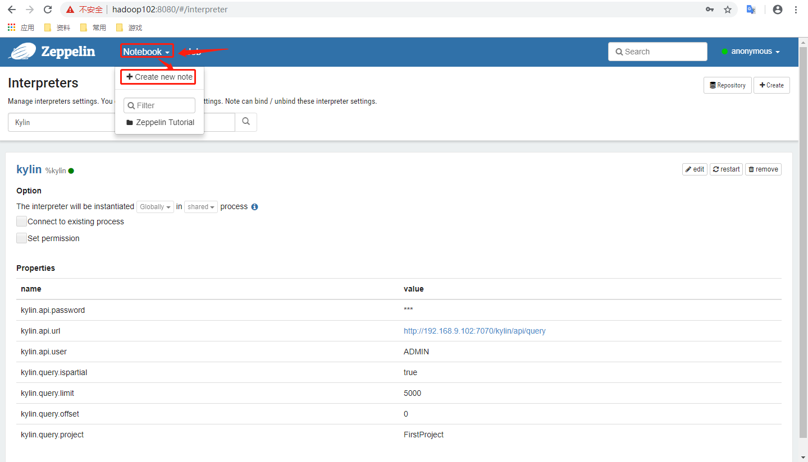

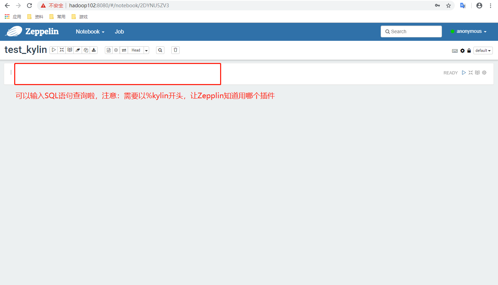
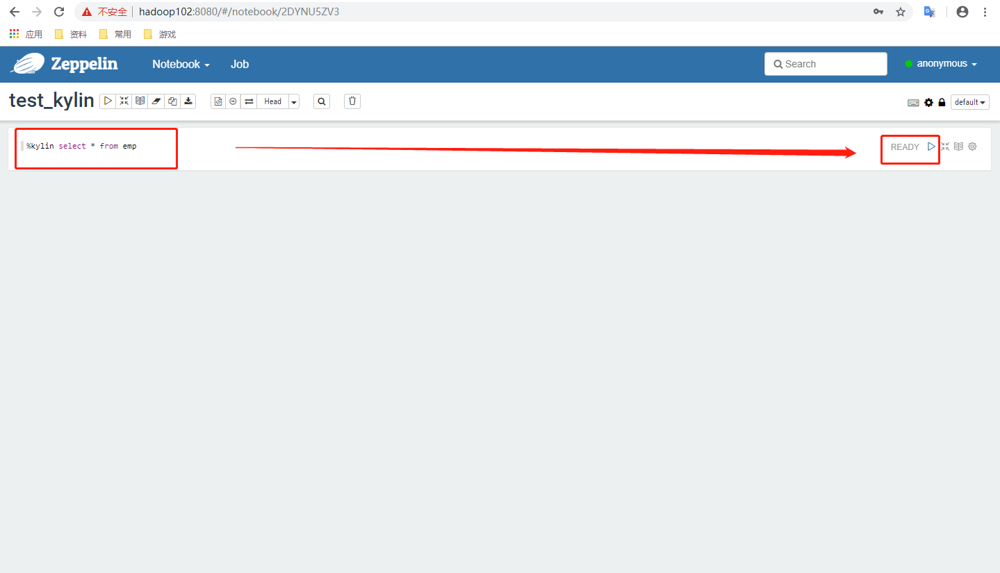

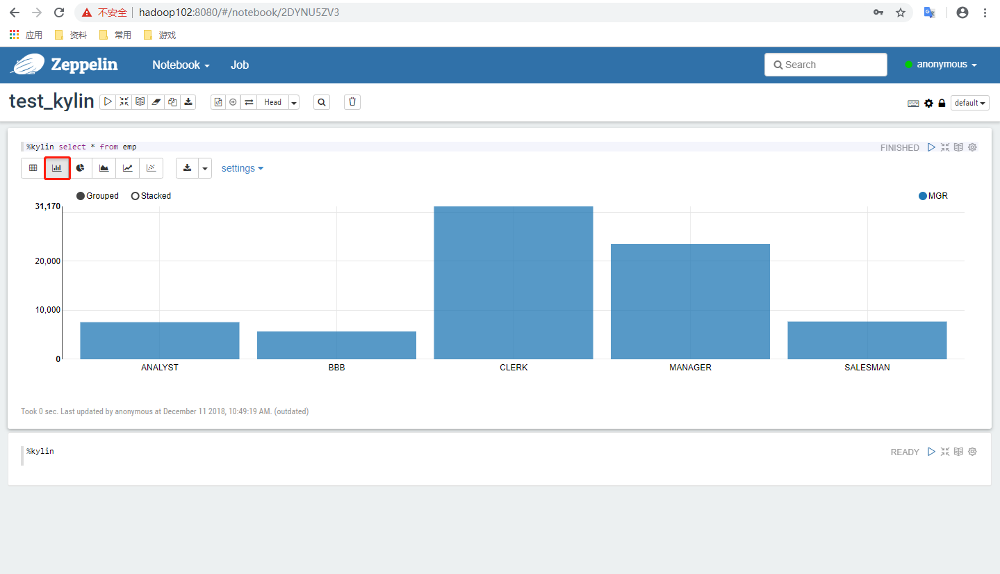

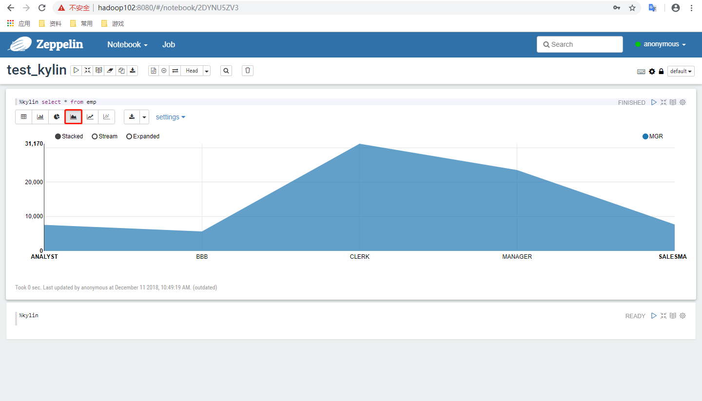

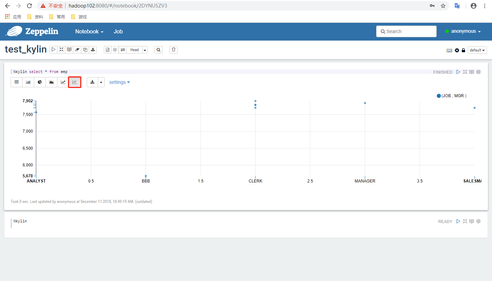

