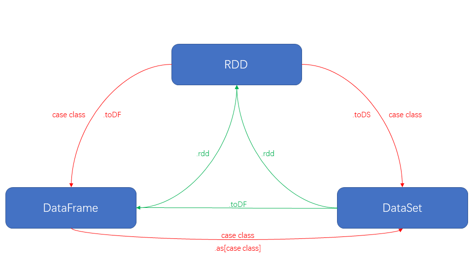

# 一、SparkSQL概述
Spark用于结构化数据处理的Spark模块
SparkSQL转换成RDD，然后提交到集群执行，SparkSQL还进行了优化
SparkSQL提供了2个编程抽象，类似SparkCore中的RDD
类似于Hive之于MR

## 1.特点
### 1.1 Integrated(易整合)
无缝的整合了SQL查询和spark编程

### 1.2 Uniform Data Access(统一的数据访问方式)
使用相同的方式连接不同的资源

### 1.3 Hive Integration(继承Hive)
在已有的仓库直接运行SQL或者HiveSQL

### 1.4 Standard Connectivity(标准的连接方式)
通过jdbc或odbc来连接

## 2.DataFrame
和RDD类似，DataFrame也是一个分布式数据容器
更像传统数据库的二维表格，除了数据以外还记录数据的结构信息(schema)
与Hive类似，支持嵌套型数据(struct、array和map)
DataFrame API提供的是一套高层的关系操作，比函数式RDD API更友好
懒执行
查询通过`Spark catalyst optimizer`优化，性能比RDD更高

**逻辑查询计划优化**就是一个利用基于关系代数的等价变换，将高成本的操作替换为低成本操作的过程

## 3.DataSet
是DataFrame的扩展，SparkSQL最新的数据抽象
类型校验
样例类用作DS数据的结构化信息
DF是DS的特例(DS中存放Row时即为DF)
DS为强类型，可以有`DataSet[Car]`、 `DataSet[Person]`

# 二、SparkSQL编程

## 1.SparkSession
SparkSession是Spark最新的SQL查询起始点，实质上是SQLContext和HiveContext的组合，两者的API都是用，实际计算由SparkContext完成。
spark-shell自动创建名为spark的SparkSession
```
Spark context available as 'sc' (master = local[*], app id = local-1569004638499).
Spark session available as 'spark'.
```

## 2.使用DataFrame进行编程

### 2.1 创建DataFrame
#### 2.1.1 创建方式
数据源
rdd -> df
hive -> df

Spark支持的数据源:
csv format jdbc json load option options orc parquet schema table text textFile

```scala
//读取json文件
val df = spark.read.json("/opt/module/spark-local/examples/src/main/resources/people.json")
df.show
```

#### 2.1.2 DataFrame语言风格 * 
1. **sql风格**
创建临时表
在临时表上创建sql语句
 * 表冲突异常
 * 三种创建表的方式

```scala
df.createTempView("user") //如果表重复，抛出异常
df.createOrReplaceTempView("user") //
spark.sql("select * from user").show
```

* 临时视图只能在当前Session有效，在新的Session中无效
* 可以创建全局视图，访问全局视图需要全路径`global_temp.user`

```scala
df.createGlobalTempView("people") //全局表，在新的session也可以使用
spark.newSession.sql("select * from global_temp.people").show
```

2. **dsl风格**
DataFrame提供一个特定领域语言(domain-specific language, DSL)去管理结构化的数据. 可以在 Scala, Java, Python 和 R 中使用 DSL
使用 DSL 语法风格不必创建临时视图

```scala
df.printSchema
df.select($"name").show
df.select("name").show
df.select("name", "age").show
df.select($"name", $"age" + 1).show
df.filter($"age" > 21).show
df.groupBy("age").count.show
```

 * 涉及到运算的时候，每列都必须使用$

## 3.使用DataSet进行编程
DataSet是具有强类型的数据集合，需要提供对应的类型信息。

```scala
case class Person(name:String,age:Int)
//使用样例类创建ds
val ds = Seq(Person("lisi", 20), Person("zs", 21)).toDS
ds.show
import spark.implicits._ //spark-shell中会自动导入
val ds = Seq(1,2,3,4,5,6).toDS //使用基本类型序列创建ds
```

 * 在实际使用的时候, 很少用到把序列转换成 DataSet, 更多的是通过RDD来得到DataSet

## 4.RDD DF DS之间的交互
```scala
// RDD -> DF
val rdd1 =
    spark.sparkContext.parallelize(Array(("Tom", 22, "male"), ("Jack", 21, "female")))
val rdd2 = //样例类RDD
    spark.sparkContext.parallelize(Array(User("Tom", 22, "male"), User("Jack", 21, "female")))
rdd1.toDF("name", "age", "sex").show
rdd2.toDF.show //样例类会自动添加字段名

// DF -> RDD
val rdd2 = df.rdd //rdd中存放的是Row
rdd2.map(row => {
    row.getString(0) //如果第一个元素类型不是String，会报错
}).collect.foreach(println)

// RDD -> DS
val ds = rdd1.toDS

// DS -> RDD
 val rdd2 = ds.rdd //样例类RDD

// DF -> DS
val ds2 = df.as[User]

// DS -> DF
val df2 = ds2.toDF
```



## 5.RDD DF DS之间的关系
**RDD(Spark 1.0)**
↓ 支持sql
**DateFrame(Spark 1.3)**
↓ 弱类型到强类型
**Dataset(Spark 1.6)**

### 5.1 共性
1.	RDD、DataFrame、Dataset全都是 Spark 平台下的分布式弹性数据集，为处理超大型数据提供便利
2.	三者都有惰性机制，在进行创建、转换，如map方法时，不会立即执行，只有在遇到Action如foreach时，三者才会开始遍历运算。
3.	三者都会根据 Spark 的内存情况自动缓存运算，这样即使数据量很大，也不用担心会内存溢出
4.	三者都有partition的概念
5.	三者有许多共同的函数，如map, filter，排序等
6.	在对 DataFrame和Dataset进行操作许多操作都需要这个包进行支持 import spark.implicits._
7.	DataFrame和Dataset均可使用模式匹配获取各个字段的值和类型


### 5.2 区别
>**RDD**
RDD一般和spark mlib同时使用
RDD不支持sparksql操作

>**DataFrame**
与RDD和Dataset不同，DataFrame每一行的类型固定为Row，每一列的值没法直接访问，只有通过解析才能获取各个字段的值，
DataFrame与DataSet一般不与 spark mlib 同时使用
DataFrame与DataSet均支持 SparkSQL 的操作，比如select，groupby之类，还能注册临时表/视窗，进行 sql 语句操作
DataFrame与DataSet支持一些特别方便的保存方式，比如保存成csv，可以带上表头，这样每一列的字段名一目了然(后面专门讲解)

>**DataSet**
Dataset和DataFrame拥有完全相同的成员函数，区别只是每一行的数据类型不同。 DataFrame其实就是DataSet的一个特例
DataFrame也可以叫Dataset[Row],每一行的类型是Row，不解析，每一行究竟有哪些字段，各个字段又是什么类型都无从得知，只能用上面提到的getAS方法或者共性中的第七条提到的模式匹配拿出特定字段。而Dataset中，每一行是什么类型是不一定的，在自定义了case class之后可以很自由的获得每一行的信息

## 6.自定义SparkSQL函数
### 6.1 UDF
```scala
val df = spark.read.json("examples/src/main/resources/people.json")
// 注册一个 udf 函数: toUpper是函数名, 第二个参数是函数的具体实现
spark.udf.register("toUpper", (s: String) => s.toUpperCase)
df.createOrReplaceTempView("people")
spark.sql("select toUpper(name), age from people").show
```

### 6.2 UDAF
```scala
//求和
class MySum extends UserDefinedAggregateFunction {
    //定义聚合函数输入数据的类型,如果求平均值，需要缓存两个值
    override def inputSchema: StructType = StructType(StructField("column", DoubleType) :: Nil)
    //缓冲区的数据类型
    override def bufferSchema: StructType = StructType(StructField("sum", DoubleType) :: Nil)
    //最终的返回值类型
    override def dataType: DataType = DoubleType
    //确定性，指相同的输入是否应该返回相同的输出
    override def deterministic: Boolean = true
    //初始化，定义缓冲区的零值
    override def initialize(buffer: MutableAggregationBuffer): Unit = buffer(0) = 0d
    //分区内的聚合
    override def update(buffer: MutableAggregationBuffer, input: Row): Unit =
        buffer(0) = buffer.getDouble(0) + input.getAs[Double](0) //buffer取值必须指明类型
    //分区间的聚合，最终运算结果复制给buffer1
    override def merge(buffer1: MutableAggregationBuffer, buffer2: Row): Unit =
        buffer1(0) = buffer1.getDouble(0) + buffer2.getDouble(0)
    //返回最终的值，最好指定返回值类型
    override def evaluate(buffer: Row): Double = buffer.getDouble(0)
}
```
```scala
spark.udf.register("mySum", new MySum)
val df = spark.read.json(ClassLoader.getSystemResource("employees.json").getPath)
df.createOrReplaceTempView("user")
spark.sql("select mySum(age) sum from user").show
```


