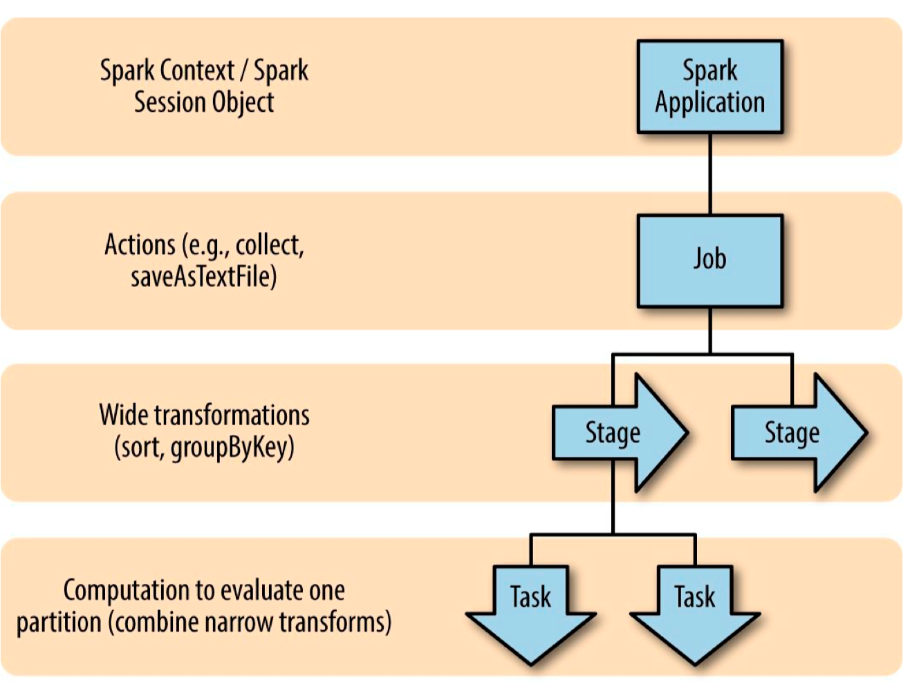
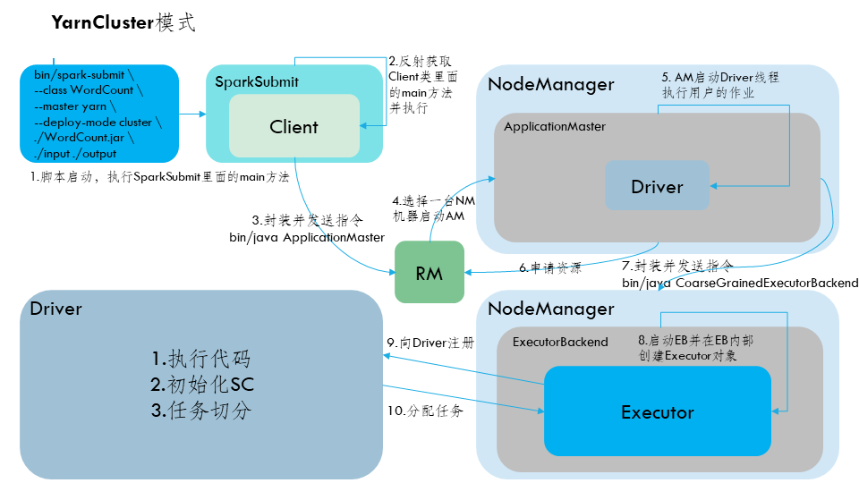

#### 1.简述Spark任务切分流程
由于 Spark 的懒执行, 在驱动程序调用一个action之前, Spark 应用不会做任何事情.
**针对每个 action, Spark 调度器就创建一个执行图(execution graph)和启动一个 Spark job**
每个 job 由多个stages 组成, 这些 stages 就是实现最终的 RDD 所需的数据转换的步骤. 一个宽依赖划分一个 stage.
每个 stage 由多个 tasks 来组成, 这些 tasks 就表示每个并行计算, 并且会在多个执行器上执行.



#### 2.请列举Spark的transformation算子
 * `map(func)` 返回要给新的RDD，该RDD由每一个输入元素经过func函数转换后组成
 * `mapPartitions(func)` 类似于map，但独立地在RDD的每一个分片上运行，因此在类型为T的RDD上运行时，func的函数u类型必须是`Iterator[T] => Iterator[U]`，假设有N个元素，有M个分区，那么map的函数将被调用N次，而mapPartitions被调用M次，一个函数一次处理所有分区
 * `reduceByKey(func, [numTask])` 在一个(K, V)的RDD上调用，返回一个(K, V)的RDD，使用reduce函数，将相同key的值聚合到一起，reduce任务的个数可以通过第二个可选的参数来设置
 * `aggregateByKey(zeroValue:U,[partition:Partitioner])(seqOp:(U,V)=>U,combOp:(U,U)=>U)` 在kv对的RDD中，按key将value进行分组合并，合并时，将每个value和初始值作为seq函数的参数，进行计算，返回的结果作为一个新的kv对，然后再将结果按照key进行合并，最后将每个分组的value传递给combine函数进行计算(先将前两个value进行计算)，将返回结果和下一个value传给combine函数，以此类推)，将key与计算结果作为一个新的kv输出。
 * `combineByKey(createCombiner:V=>C, mergeValue:(C,V)=>C,mergeCombiners:(C,C)=>C)` 对相同K，把V合并成一个集合

#### 3.请列举Spark的action算子
 * reduce
 * collect
 * first
 * aggregate
 * countByKey
 * foreach
 * saveAsTextFile
 * fold

#### 4.Spark常用算子reduceByKey与groupByKey
 * reduceByKey 按照key进行聚合，在shuffle之前有预聚合操作返回结果为`RDD[k,v]`
 * groupByKey 按照key进行分组，直接shuffle
 * 在不影响业务逻辑的前提下，reduceByKey更具有优势


#### 5.当Spark涉及到数据库的操作时如何减少连接次数
 * 使用foreachPartition算子代替foreach，每个分区获取一次连接

#### 6.SparkStreaming窗口操作的原理
 * 窗口函数就是在原来定义的SparkStreaming计算批次大小的基础上再次进行封装，每次计算多个批次的数据，同时还需要传递一个滑动步长的参数，用来设置当次计算任务完成之后下一次从什么地方开始计算
<!-- TODO 绘图表示窗口长度和滑动步长 -->


#### 7.Spark中的共享变量(广播变量和累加器)
 * 累加器(accumulator)是spark中提供的一种分布式的变量机制，其原理类似于mapreduce，即分布式的改变，然后聚合这些改变
 * 累加器主要用于累加计数性质，广播变量主要用于高效的分发较大的对象
 * Spark中在做map或者filter时，executor都会用到driver中的变量，而每个节点上操作这些变量不会真正改变driver中的值
 * 累加器和广播变量主要用于结果聚合和广播这两种通信模式

    **累加器**
 * 分布式运行，driver发给executor的是变量的值，在executor运算和driver的值无关
 * 累加器实现了共享变量的修改
 * 累加器只在行动算子中使用，不在转换算子中使用

    **广播变量**
 * 当driver传递给executor变量只用于读取时
 * 同一个进程的每一个task线程都有一个变量，数据冗余，占用内存
 * 广播变量不直接发给每个task线程，而是直接发到executor，task线程共享变量
 * 极大的优化了内存的占用

#### 8.简述Spark的架构与作业提交流程

1. 执行脚本提交任务，实际是启动一个SparkSubmit的JVM进程
2. SparkSubmit类中的main方法反射调用Client的main方法
3. Client创建Yarn客户端，然后Yarn发送执行指令`bin/java ApplicationMaster`
4. Yarn框架收到指令后会在指定的NM中启动ApplicationMaster
5. ApplicationMaster启动Driver线程，执行用户的作业
6. AM向RM注册，申请资源
7. 获取资源后AM向NM发送指令，`bin/java CoarseGrainedExecutorBackend`
8. ExecutorBackend进程会接受消息，启动计算对象Executor并跟Driver通信，注册已经启动的Executor
9. Driver分配任务并监控任务的执行

 * *SparkSubmit、ApplicationMaster和CoarseGrainedExecutorBacken是独立的进程，Client和Driver是独立的线程，Executor是一个对象*

#### 9.手写Wordcount的Spark代码实现
```scala
val conf:SparkConf=new SparkConf().setMaster("local[*]").setAppName("WordCount")
val sc=new SparkContext(conf)
sc.textFile("/input")
  .flatMap(_.split"\\W+")
  .map((_,1))
  .reduceByKey(_+_)
  .saveAsTextFile("/output")
sc.stop()
```

#### 10.Spark优化
**常规性能优化**
 * 最优资源配置
 * RDD优化
 * 并行度调节
 * 广播大变量
 * Kryo序列化
 * 调节本地化等待时长

**算子调优**
 * mapPartitions
 * foreachPartition优化数据库操作
 * filter和coalesce的配合使用
 * repartition解决SparkSQL低并行度问题
 * reduceByKey预聚合

**Shuffle调优**
 * 调节map端缓冲区大小
 * 调节reduce端拉去数据缓冲区大小
 * 调节reduce端拉去数据重试次数
 * 调节reduce端拉去数据等待间隔
 * 调节SortShuffle排序操作阈值

**JVM调优**
 * 降低cache操作的内存占比
 * 调节Executor堆外内存
 * 调节连接等待时长


