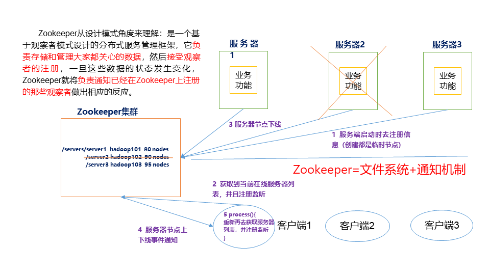
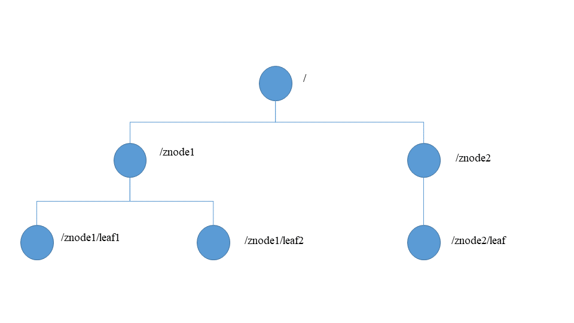
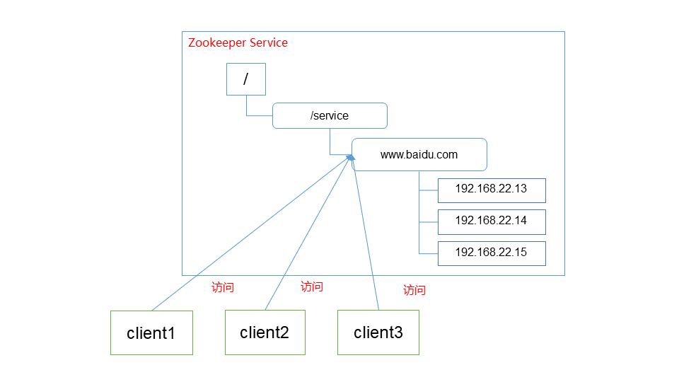
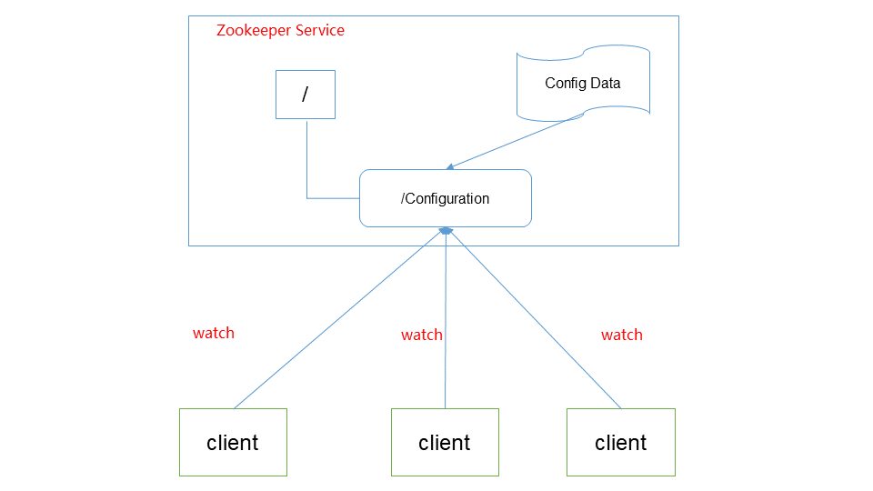
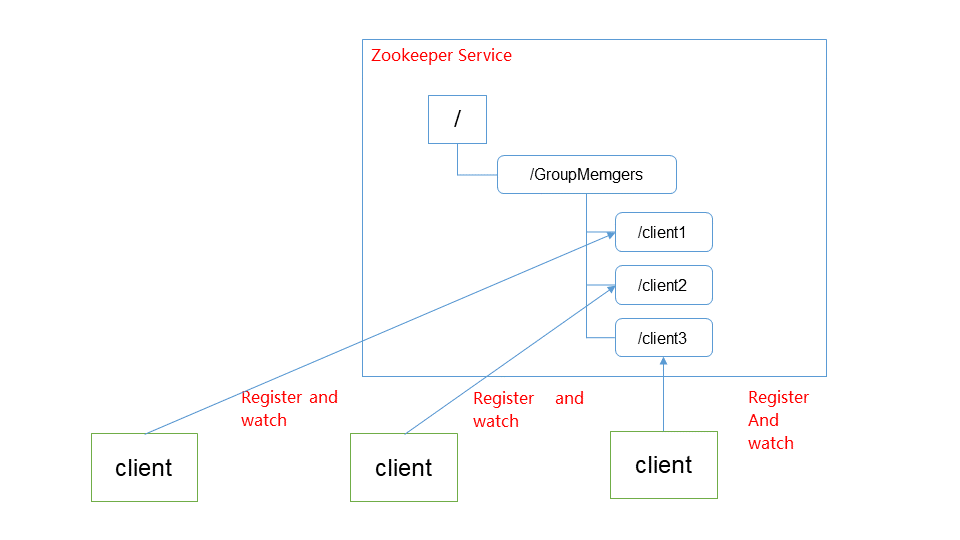
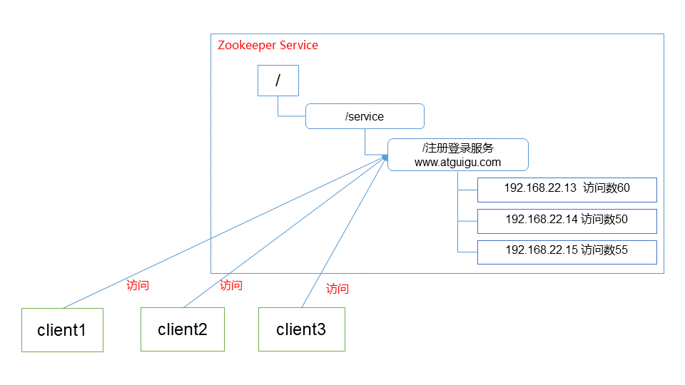
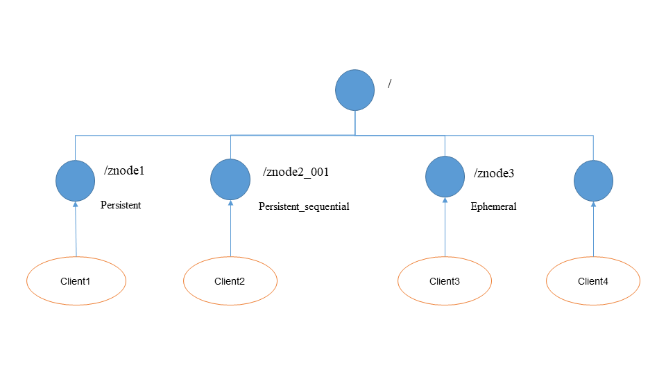
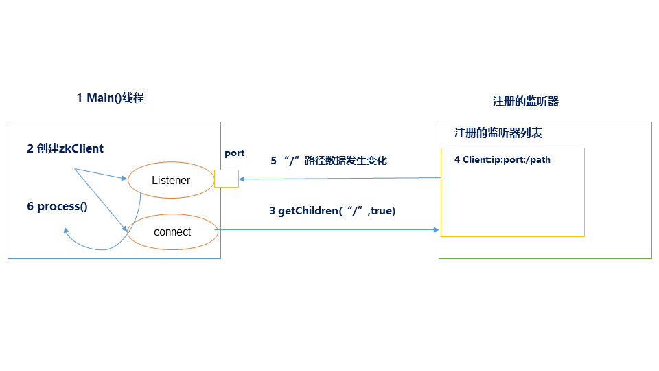
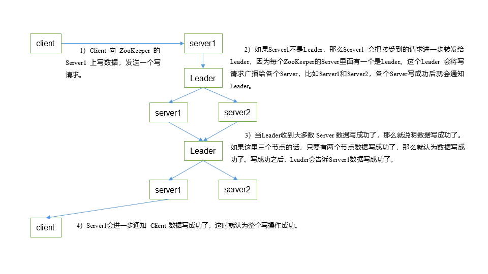

# TODO

* [ ] -
* [ ] Client端递归完成监听器的创建 *2019-7-29 16:50:44*
* [ ] 监听服务服务器节点动态上下线 *2019-7-29 16:32:47*
* [ ] zk分布式搭建与宕机模拟 *2019-7-29 14:33:42*
* [ ] 默认节点类型 *2019年7月29日 10:56:46*
* [ ] 选举机制 *2019-7-29 10:41:06*
* [ ] 半数机制与奇数台服务器 *2019-7-29 10:35:41*
* [ ] quit和close命令的区别 *2019-7-29 10:30:14*
* [ ] ZooKeeper工作机制 *2019-7-29 10:29:55*
* [ ] 补全md配图 *2019-7-29 10:45:48*

# 一、入门

## 1.概述



Zookeeper是一个开源的分布式的，为分布式应用提供协调服务的Apache项目。多作为集群提供服务的中间件.
分布式系统: 分布式系统指由很多台计算机组成的一个整体！这个整体一致对外,并且处理同一请求，系统对内透明，对外不透明！内部的每台计算机，都可以相互通信，例如使用RPC 或者是WebService！客户端向一个分布式系统发送的一次请求到接受到响应，有可能会经历多台计算机!
Zookeeper从设计模式角度来理解，是一个基于观察者模式设计的分布式服务管理框架，它负责存储和管理大家都关心的数据，然后接受观察者的注册，一旦这些数据的状态发生了变化，Zookeeper就负责通知已经在Zookeeper上注册的那些观察者做出相应的反应.

$Zookeeper = 文件系统 + 通知机制$


## 2.特点


1）Zookeeper：一个领导者（Leader），多个跟随者（Follower）组成的集群。
2）集群中只要有半数以上节点存活，Zookeeper集群就能正常服务。
3）全局数据一致：每个Server保存一份相同的数据副本，Client无论连接到哪个Server，数据都是一致的。
4）更新请求顺序进行，来自同一个Client的更新请求按其发送顺序依次执行。
5）数据更新原子性，一次数据更新要么成功，要么失败。
6）实时性，在一定时间范围内，Client能读到最新数据。


## 3.数据结构

ZooKeeper数据模型的结构与Unix文件系统很类似，整体上可以看作是一棵树，每个节点称做一个ZNode。每一个ZNode默认能够存储1MB的数据，每个ZNode都可以通过其路径唯一标识。



## 4.应用场景

**ZooKeeper服务**

>**统一命名服务**
在分布式环境下，对应用/服务进行统一命名，便于识别



>**统一配置管理**
1）分布式环境下，配置文件同步非常常见。
（1）一般要求一个集群中，所有节点的配置信息是一致的，比如 Kafka 集群。
（2）对配置文件修改后，希望能够快速同步到各个节点上。
2）配置管理可交由ZooKeeper实现。
（1）可将配置信息写入ZooKeeper上的一个Znode。
（2）各个客户端服务器监听这个Znode。
（3）一旦Znode中的数据被修改，ZooKeeper将通知各个客户端服务器。




>**统一集群管理**
1）分布式环境中，实时掌握每个节点的状态是必要的。
（1）可根据节点实时状态做出一些调整。
2）ZooKeeper可以实现实时监控节点状态变化
（1）可将节点信息写入ZooKeeper上的一个ZNode。
（2）监听这个ZNode可获取它的实时状态变化。



>**服务器节点动态上下线**


>**软负载均衡等**
在Zookeeper中记录每台服务器的访问数，让访问数最少的服务器去处理最新的客户端请求




## 5.下载地址

[官网首页](https://zookeeper.apache.org/)


# 二、安装

## 1.本地模式安装部署

```bash
tar -zxvf zookeeper-3.4.10.tar.gz -C /opt/module/
mv zoo_sample.cfg zoo.cfg #/opt/module/zookeeper-3.4.10/conf
vim zoo.cfg #/opt/module/zookeeper-3.4.10/
#修改内容 dataDir=/opt/module/zookeeper-3.4.10/zkData
mkdir zkData
```

```bash
#（1）启动Zookeeper
bin/zkServer.sh start

#（2）查看进程是否启动
jps
#4020 Jps
#4001 QuorumPeerMain

#（3）查看状态：
bin/zkServer.sh status
#ZooKeeper JMX enabled by default
#Using config: /opt/module/zookeeper-3.4.10/bin/../conf/zoo.cfg
#Mode: standalone

#（4）启动客户端：
bin/zkCli.sh

#（5）退出客户端：
quit #[zk: localhost:2181(CONNECTED) 0] 

#（6）停止Zookeeper
bin/zkServer.sh stop
```

## 2.Zookeeper的四字命令

Zookeeper支持某些特定的四字命令(The Four Letter Words) 与其进行交互，它们大多是查询命令，用来获取Zookeeper服务的当前状态及相关信息，用户在客户端可以通过telnet
或nc 向Zookeeper提交相应的命令。

命令|描述
:-:|:-
ruok	| 测试服务是否处于正确状态，如果确实如此，那么服务返回 imok ,否则不做任何响应。
conf 	| 3.3.0版本引入的，打印出服务相关配置的详细信息
cons 	| 列出所有连接到这台服务器的客户端全部会话详细信息。包括 接收/发送的包数量，会话id，操作延迟、最后的操作执行等等信息
crst 	| 重置所有连接的连接和会话统计信息
dump	| 列出那些比较重要的会话和临时节点。这个命令只能在leader节点上有用
envi	| 打印出服务环境的详细信息

*注: 使用之前，需要先安装nc，可以使用yum方式进行安装.*

## 3.配置参数解读

Zookeeper中的配置文件zoo.cfg中参数含义解读如下：
1．tickTime =2000：通信心跳数，Zookeeper服务器与客户端心跳时间，单位毫秒
Zookeeper使用的基本时间，服务器之间或客户端与服务器之间维持心跳的时间间隔，也就是每个tickTime时间就会发送一个心跳，时间单位为毫秒。
它用于心跳机制，并且设置最小的session超时时间为两倍心跳时间。(session的最小超时时间是2*tickTime)
2．initLimit =10：LF初始通信时限
集群中的Follower跟随者服务器与Leader领导者服务器之间初始连接时能容忍的最多心跳数（tickTime的数量），用它来限定集群中的Zookeeper服务器连接到Leader的时限。
3．syncLimit =5：LF同步通信时限
集群中Leader与Follower之间的最大响应时间单位，假如响应超过syncLimit * tickTime，Leader认为Follwer死掉，从服务器列表中删除Follwer。
4．dataDir：数据文件目录+数据持久化路径
主要用于保存Zookeeper中的数据。
5．clientPort =2181：客户端连接端口
监听客户端连接的端口。

# 三、内部原理

## 1.选举机制(面试重点)

**半数机制**：集群中半数以上机器存活，集群可用。所以Zookeeper适合安装**奇数**台服务器。

Zookeeper虽然在配置文件中并没有指定Master和Slave。但是，Zookeeper工作时，是有一个节点为Leader，其他则为Follower，Leader是通过内部的选举机制临时产生的。

假设有五台服务器组成的Zookeeper集群，它们的id从1-5，同时它们都是最新启动的，也就是没有历史数据，在存放数据量这一点上，都是一样的。假设这些服务器依序启动，


（1）服务器1启动，此时只有它一台服务器启动了，它发出去的报文没有任何响应，所以它的选举状态一直是LOOKING状态。
（2）服务器2启动，它与最开始启动的服务器1进行通信，互相交换自己的选举结果，由于两者都没有历史数据，所以id值较大的服务器2胜出，但是由于没有达到超过半数以上的服务器都同意选举它(这个例子中的半数以上是3)，所以服务器1、2还是继续保持LOOKING状态。
（3）服务器3启动，根据前面的理论分析，服务器3成为服务器1、2、3中的老大，而与上面不同的是，此时有三台服务器选举了它，所以它成为了这次选举的Leader。
（4）服务器4启动，根据前面的分析，理论上服务器4应该是服务器1、2、3、4中最大的，但是由于前面已经有半数以上的服务器选举了服务器3，所以它只能接收当小弟的命了。
（5）服务器5启动，同4一样当小弟。


## 2.节点类型

持久（Persistent）：客户端和服务器端断开连接后，创建的节点不删除
短暂（Ephemeral）：客户端和服务器端断开连接后，创建的节点自己删除



（1）持久化目录节点
客户端与Zookeeper断开连接后，该节点依旧存在

（2）持久化顺序编号目录节点
客户端与Zookeeper断开连接后，该节点依旧存在，只是Zookeeper给该节点名称进行顺序编号

（3）临时目录节点
客户端与Zookeeper断开连接后，该节点被删除

（4）临时顺序编号目录节点
客户端与Zookeeper断开连接后，该节点被删除，只是Zookeeper给该节点名称进行顺序编号。

说明：创建znode时设置顺序标识，znode名称后会附加一个值，顺序号是一个单调递增的计数器，由父节点维护
注意：在分布式系统中，顺序号可以被用于为所有的事件进行全局排序，这样客户端可以通过顺序号推断事件的顺序


## 3.Stat结构体

1）**czxid**-创建节点的事务zxid
每次修改ZooKeeper状态都会收到一个zxid形式的时间戳，也就是ZooKeeper事务ID。
事务ID是ZooKeeper中所有修改总的次序。每个修改都有唯一的zxid，如果zxid1小于zxid2，那么zxid1在zxid2之前发生。
2）**ctime** - znode被创建的毫秒数(从1970年开始)
3）**mzxid** - znode最后更新的事务zxid
4）**mtime** - znode最后修改的毫秒数(从1970年开始)
5）**pZxid**-znode最后更新的子节点zxid
6）**cversion** - znode子节点变化号，znode子节点修改次数
7）**dataversion** - znode数据变化号
8）**aclVersion** - znode访问控制列表的变化号
9）**ephemeralOwner** - 如果是临时节点，这个是znode拥有者的session id。如果不是临时节点则是0。
10）**dataLength** - znode的数据长度
11）**numChildren** - znode子节点数量


## 4.监听器原理(面试重点)

>原理详解
1）首先要有一个main()线程
2）在main线程中创建Zookeeper客户端，这时就会创建两个线程，一个负责网络连接通信（connet），一个负责监听（listener）。
3）通过connect线程将注册的监听事件发送给Zookeeper。
4）在Zookeeper的注册监听器列表中将注册的监听事件添加到列表中。
5）Zookeeper监听到有数据或路径变化，就会将这个消息发送给listener线程。
6）listener线程内部调用了process()方法。

>常见监听
1）监听节点数据的变化
`get path [watch]`
2）监听子节点增减的变化
`ls path [watch]`



## 5.写数据流程



# 四、实战(开发重点)

## 1.分布式安装部署

**规划与安装配置**

```bash
xsync zookeeper-3.4.10/ #同步zk安装目录
source /etc/profile

### 配置服务器编号
# （1）在/opt/module/zookeeper-3.4.10/这个目录下创建zkData
mkdir -p zkData
# （2）在/opt/module/zookeeper-3.4.10/zkData目录下创建一个myid的文件
touch myid
# 添加myid文件，注意一定要在linux里面创建，在notepad++里面很可能乱码
# （3）编辑myid文件
vi myid
# 在文件中添加与server对应的编号：
# 2
# （4）拷贝配置好的zookeeper到其他机器上
xsync myid
# 并分别在hadoop102、hadoop103上修改myid文件中内容为3、4

### 配置zoo.cfg文件
# （1）重命名/opt/module/zookeeper-3.4.10/conf这个目录下的zoo_sample.cfg为zoo.cfg
mv zoo_sample.cfg zoo.cfg
# （2）打开zoo.cfg文件
vim zoo.cfg
# 修改数据存储路径配置
# dataDir=/opt/module/zookeeper-3.4.10/zkData
# 增加如下配置
#######################cluster##########################
# server.2=hadoop102:2888:3888
# server.3=hadoop103:2888:3888
# server.4=hadoop104:2888:3888
# （3）同步zoo.cfg配置文件
xsync zoo.cfg
# （4）配置参数解读
# server.A=B:C:D。
# A是一个数字，表示这个是第几号服务器
```

```zoo.cfg
dataDir=/opt/module/zookeeper-3.4.10/zkData

#######################cluster##########################
server.2=hadoop102:2888:3888
server.3=hadoop103:2888:3888
server.4=hadoop104:2888:3888
```

集群模式下配置一个文件myid，这个文件在dataDir目录下，这个文件里面有一个数据就是A的值，Zookeeper启动时读取此文件，拿到里面的数据与zoo.cfg里面的配置信息比较从而判断到底是哪个server。
B是这个服务器的ip地址；
C是这个服务器与集群中的Leader服务器交换信息的端口；
D是万一集群中的Leader服务器挂了，需要一个端口来重新进行选举，选出一个新的Leader，而这个端口就是用来执行选举时服务器相互通信的端口。

**集群操作**

```bash
# 分别启动Zookeeper
bin/zkServer.sh start #101
bin/zkServer.sh start #102
bin/zkServer.sh start #103
# 查看状态
bin/zkServer.sh status #101
# JMX enabled by default
# Using config: /opt/module/zookeeper-3.4.10/bin/../conf/zoo.cfg
# Mode: follower
bin/zkServer.sh status #102
# JMX enabled by default
# Using config: /opt/module/zookeeper-3.4.10/bin/../conf/zoo.cfg
# Mode: leader
bin/zkServer.sh status #103
# JMX enabled by default
# Using config: /opt/module/zookeeper-3.4.10/bin/../conf/zoo.cfg
# Mode: follower
```

## 2.客户端命令操作

命令基本语法	| 功能描述
:-:|:-
`help`|	显示所有操作命令
`ls path [watch]`|	使用 ls 命令来查看当前znode中所包含的内容
`ls2 path [watch]`|	查看当前节点数据并能看到更新次数等数据
`create`|	普通创建 <br> `-s` 含有序列 <br>`-e`  临时（重启或者超时消失）
`get path [watch]`|	获得节点的值
`set`|	设置节点的具体值
`stat`|	查看节点状态
`delete`|	删除节点
`rmr`	|递归删除节点

```bash
# 1．启动客户端
bin/zkCli.sh #103
# 2．显示所有操作命令
[zk: localhost:2181(CONNECTED) 1] help
# 3．查看当前znode中所包含的内容
[zk: localhost:2181(CONNECTED) 0] ls /
[zookeeper]
# 4．查看当前节点详细数据
[zk: localhost:2181(CONNECTED) 1] ls2 /
# [zookeeper]
# cZxid = 0x0
# ctime = Thu Jan 01 08:00:00 CST 1970
# mZxid = 0x0
# mtime = Thu Jan 01 08:00:00 CST 1970
# pZxid = 0x0
# cversion = -1
# dataVersion = 0
# aclVersion = 0
# ephemeralOwner = 0x0
# dataLength = 0
# numChildren = 1
# 5．分别创建2个普通节点
[zk: localhost:2181(CONNECTED) 3] create /sanguo "jinlian"
# Created /sanguo
[zk: localhost:2181(CONNECTED) 4] create /sanguo/shuguo "liubei"
# Created /sanguo/shuguo
# 6．获得节点的值
[zk: localhost:2181(CONNECTED) 5] get /sanguo #末尾不能待斜杠
# jinlian
# cZxid = 0x100000003
# ctime = Wed Aug 29 00:03:23 CST 2018
# mZxid = 0x100000003
# mtime = Wed Aug 29 00:03:23 CST 2018
# pZxid = 0x100000004
# cversion = 1
# dataVersion = 0
# aclVersion = 0
# ephemeralOwner = 0x0
# dataLength = 7
# numChildren = 1
[zk: localhost:2181(CONNECTED) 6]
[zk: localhost:2181(CONNECTED) 6] get /sanguo/shuguo
# liubei
# cZxid = 0x100000004
# ctime = Wed Aug 29 00:04:35 CST 2018
# mZxid = 0x100000004
# mtime = Wed Aug 29 00:04:35 CST 2018
# pZxid = 0x100000004
# cversion = 0
# dataVersion = 0
# aclVersion = 0
# ephemeralOwner = 0x0
# dataLength = 6
# numChildren = 0
# 7．创建短暂节点
[zk: localhost:2181(CONNECTED) 7] create -e /sanguo/wuguo "zhouyu"
# Created /sanguo/wuguo
# （1）在当前客户端是能查看到的
[zk: localhost:2181(CONNECTED) 3] ls /sanguo 
# [wuguo, shuguo]
# （2）退出当前客户端然后再重启客户端
[zk: localhost:2181(CONNECTED) 12] quit
bin/zkCli.sh
# （3）再次查看根目录下短暂节点已经删除
[zk: localhost:2181(CONNECTED) 0] ls /sanguo
# [shuguo]
# 8．创建带序号的节点
# （1）先创建一个普通的根节点/sanguo/weiguo
[zk: localhost:2181(CONNECTED) 1] create /sanguo/weiguo "caocao"
# Created /sanguo/weiguo
# （2）创建带序号的节点
[zk: localhost:2181(CONNECTED) 2] create -s /sanguo/weiguo/xiaoqiao "jinlian"
# Created /sanguo/weiguo/xiaoqiao0000000000
[zk: localhost:2181(CONNECTED) 3] create -s /sanguo/weiguo/daqiao "jinlian"
# Created /sanguo/weiguo/daqiao0000000001
[zk: localhost:2181(CONNECTED) 4] create -s /sanguo/weiguo/diaocan "jinlian"
# Created /sanguo/weiguo/diaocan0000000002
# 如果原来没有序号节点，序号从0开始依次递增。如果原节点下已有2个节点，则再排序时从2开始，以此类推。
# 9．修改节点数据值
[zk: localhost:2181(CONNECTED) 6] set /sanguo/weiguo "simayi"
# 10．节点的值变化监听
# （1）在hadoop104主机上注册监听/sanguo节点数据变化
[zk: localhost:2181(CONNECTED) 26] [zk: localhost:2181(CONNECTED) 8] get /sanguo watch
# （2）在hadoop103主机上修改/sanguo节点的数据
[zk: localhost:2181(CONNECTED) 1] set /sanguo "xisi"
# （3）观察hadoop104主机收到数据变化的监听
# WATCHER::
# WatchedEvent state:SyncConnected type:NodeDataChanged path:/sanguo
# 11．节点的子节点变化监听（路径变化）
# （1）在hadoop104主机上注册监听/sanguo节点的子节点变化
[zk: localhost:2181(CONNECTED) 1] ls /sanguo watch
# [aa0000000001, server101]
# （2）在hadoop103主机/sanguo节点上创建子节点
[zk: localhost:2181(CONNECTED) 2] create /sanguo/jin "simayi"
# Created /sanguo/jin
# （3）观察hadoop104主机收到子节点变化的监听
# WATCHER::
# WatchedEvent state:SyncConnected type:NodeChildrenChanged path:/sanguo
# 12．删除节点
[zk: localhost:2181(CONNECTED) 4] delete /sanguo/jin
# 13．递归删除节点(用于删除非空节点)
[zk: localhost:2181(CONNECTED) 15] rmr /sanguo/shuguo
# 14．查看节点状态
[zk: localhost:2181(CONNECTED) 17] stat /sanguo
# cZxid = 0x100000003
# ctime = Wed Aug 29 00:03:23 CST 2018
# mZxid = 0x100000011
# mtime = Wed Aug 29 00:21:23 CST 2018
# pZxid = 0x100000014
# cversion = 9
# dataVersion = 1
# aclVersion = 0
# ephemeralOwner = 0x0
# dataLength = 4
# numChildren = 1
```


## 3.API应用

### 3.1 Eclipse环境搭建

**创建maven工程**

**pom.xml**
```xml
<dependencies>
		<dependency>
			<groupId>junit</groupId>
			<artifactId>junit</artifactId>
			<version>RELEASE</version>
		</dependency>
		<dependency>
			<groupId>org.apache.logging.log4j</groupId>
			<artifactId>log4j-core</artifactId>
			<version>2.8.2</version>
		</dependency>
		<!-- https://mvnrepository.com/artifact/org.apache.zookeeper/zookeeper -->
		<dependency>
			<groupId>org.apache.zookeeper</groupId>
			<artifactId>zookeeper</artifactId>
			<version>3.4.10</version>
		</dependency>
</dependencies>
```

**log4j.properties**
```properties
log4j.rootLogger=INFO, stdout  
log4j.appender.stdout=org.apache.log4j.ConsoleAppender  
log4j.appender.stdout.layout=org.apache.log4j.PatternLayout  
log4j.appender.stdout.layout.ConversionPattern=%d %p [%c] - %m%n  
log4j.appender.logfile=org.apache.log4j.FileAppender  
log4j.appender.logfile.File=target/spring.log  
log4j.appender.logfile.layout=org.apache.log4j.PatternLayout  
log4j.appender.logfile.layout.ConversionPattern=%d %p [%c] - %m%n
```

### 3.2 创建ZooKeeper客户端

```java
//创建zk客户端
private static String connectString =
 "hadoop102:2181,hadoop103:2181,hadoop104:2181";
	private static int sessionTimeout = 2000;
	private ZooKeeper zkClient = null;

	@Before
	public void init() throws Exception {

	zkClient = new ZooKeeper(connectString, sessionTimeout, new Watcher() {

        @Override
        public void process(WatchedEvent event) {

            // 收到事件通知后的回调函数（用户的业务逻辑）
            System.out.println(event.getType() + "--" + event.getPath());

            // 再次启动监听
            try {
                zkClient.getChildren("/", true);
            } catch (Exception e) {
                e.printStackTrace();
            }
        }
    });
}
```

### 3.3 创建子节点

```java
// 创建子节点
@Test
public void create() throws Exception {

		// 参数1：要创建的节点的路径； 参数2：节点数据 ； 参数3：节点权限 ；参数4：节点的类型
		String nodeCreated = zkClient.create("/tian", "jinlian".getBytes(), Ids.OPEN_ACL_UNSAFE, CreateMode.PERSISTENT);
}
```

### 3.4 获取子节点并监听节点变化


```java
// 获取子节点
@Test
public void getChildren() throws Exception {
	//监听只负责一次
	List<String> children = zkClient.getChildren("/", true);

	for (String child : children) {
		System.out.println(child);
	}

	// 延时阻塞
	Thread.sleep(Long.MAX_VALUE);
}
```

### 3.5 判断Znode是否存在

```java
// 判断znode是否存在
@Test
public void exist() throws Exception {

	Stat stat = zkClient.exists("/eclipse", false);

	System.out.println(stat == null ? "not exist" : "exist");
}
```

## 4.监听服务器节点动态上下线案例

**需求**
某分布式系统中，主节点可以有多台，可以动态上下线，任意一台客户端都能实时感知到主节点服务器的上下线。

**需求分析**


**具体实现**

（0）先在集群上创建/servers节点
```bash
[zk: localhost:2181(CONNECTED) 10] create /servers "servers"
# Created /servers
```

（1）服务器端向Zookeeper注册代码
```java
package com.tian.zkcase;
import java.io.IOException;
import org.apache.zookeeper.CreateMode;
import org.apache.zookeeper.WatchedEvent;
import org.apache.zookeeper.Watcher;
import org.apache.zookeeper.ZooKeeper;
import org.apache.zookeeper.ZooDefs.Ids;

public class DistributeServer {

	private static String connectString = "hadoop102:2181,hadoop103:2181,hadoop104:2181";
	private static int sessionTimeout = 2000;
	private ZooKeeper zk = null;
	private String parentNode = "/servers";
	
	// 创建到zk的客户端连接
	public void getConnect() throws IOException{
		
		zk = new ZooKeeper(connectString, sessionTimeout, new Watcher() {

			@Override
			public void process(WatchedEvent event) {

			}
		});
	}
	
	// 注册服务器
	public void registServer(String hostname) throws Exception{

		String create = zk.create(parentNode + "/server", hostname.getBytes(), Ids.OPEN_ACL_UNSAFE, CreateMode.EPHEMERAL_SEQUENTIAL);
		
		System.out.println(hostname +" is online "+ create);
	}
	
	// 业务功能
	public void business(String hostname) throws Exception{
		System.out.println(hostname+" is working ...");
		
		Thread.sleep(Long.MAX_VALUE);
	}
	
	public static void main(String[] args) throws Exception {
		
// 1获取zk连接
		DistributeServer server = new DistributeServer();
		server.getConnect();
		
		// 2 利用zk连接注册服务器信息
		server.registServer(args[0]);
		
		// 3 启动业务功能
		server.business(args[0]);
	}
}
```

（2）客户端代码
```java
package com.tian.zkcase;
import java.io.IOException;
import java.util.ArrayList;
import java.util.List;
import org.apache.zookeeper.WatchedEvent;
import org.apache.zookeeper.Watcher;
import org.apache.zookeeper.ZooKeeper;

public class DistributeClient {

	private static String connectString = "hadoop102:2181,hadoop103:2181,hadoop104:2181";
	private static int sessionTimeout = 2000;
	private ZooKeeper zk = null;
	private String parentNode = "/servers";

	// 创建到zk的客户端连接
	public void getConnect() throws IOException {
		zk = new ZooKeeper(connectString, sessionTimeout, new Watcher() {

			@Override
			public void process(WatchedEvent event) {

				// 再次启动监听
				try {
					getServerList();
				} catch (Exception e) {
					e.printStackTrace();
				}
			}
		});
	}

	// 获取服务器列表信息
	public void getServerList() throws Exception {
		
		// 1获取服务器子节点信息，并且对父节点进行监听
		// 不只是监听一次，自定义监听器，并递归调用
		List<String> children = zk.getChildren(parentNode, true);

        // 2存储服务器信息列表
		ArrayList<String> servers = new ArrayList<>();
		
        // 3遍历所有节点，获取节点中的主机名称信息
		for (String child : children) {
			byte[] data = zk.getData(parentNode + "/" + child, false, null);

			servers.add(new String(data));
		}

        // 4打印服务器列表信息
		System.out.println(servers);
	}

	// 业务功能
	public void business() throws Exception{
		System.out.println("client is working ...");
		Thread.sleep(Long.MAX_VALUE);
	}

	public static void main(String[] args) throws Exception {

		// 1获取zk连接
		DistributeClient client = new DistributeClient();
		client.getConnect();

		// 2获取servers的子节点信息，从中获取服务器信息列表
		client.getServerList();

		// 3业务进程启动
		client.business();
	}
}
```

# 五、企业面试真题(面试重点)


## 1.简述ZooKeeper的选举机制


## 2.ZooKeeper的监听原理


## 3.ZooKeeper部署方式，集群中的角色，部署机器数量


## 4.ZooKeeper常用命令


